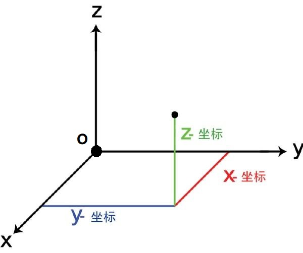

# CSS 理论知识点

> 记录一些（那啥需要的）理论知识点，其他的 [CSS 语法与技巧请点这里](/workflow/css/spec)

## 介绍一下盒模型

::: tip 什么是盒模型？

当对一个文档进行布局时，浏览器的渲染引擎会根据标准之一的 **`CSS` 基础框盒模型**（CSS basic box model），将所有元素表示为一个个矩形的盒子；`CSS` 决定这些盒子的大小、位置以及属性（如颜色、背景、边框尺寸等）

每个盒子（即盒模型）从外到内由这四个部分组成

- `margin` 外边距（不计入盒子的实际大小）
- `border` 边框
- `padding` 内边距
- `content` 内容

[CSS 基础框盒模型介绍 - CSS：层叠样式表 | MDN](https://developer.mozilla.org/zh-CN/docs/Web/CSS/CSS_Box_Model/Introduction_to_the_CSS_box_model)

:::

盒模型分为 **`W3C` 标准盒模型**和 **`IE` 盒模型**，其区别只有一个：**计算盒子实际大小（即总宽度/总高度）的方式不一样**

> 以宽度计算来举 🌰

- `W3C` 标准盒模型（默认）
  - **盒子实际宽 = `width` + `padding` + `border`**
  - 其中 **`width` 只包含 `content`**（即内容区域的宽度）
  - **通过 `box-sizing: content-box;` 来设置为 `W3C` 标准盒模型**
- `IE` 盒模型
  - **盒子实际宽 = `width`**
  - 其中 **`width` = `content` + `border` + `padding`**
  - **通过 `box-sizing: border-box;` 来设置为 `IE` 盒模型**

## 什么是 `BFC` ？

> 先了解一些前置知识：格式化上下文（Formatting Context）

::: tip 前置知识：格式化上下文（Formatting Context）
格式化上下文（Formatting Context）即 `FC`，**是 `Web` 页面中一种特殊的渲染区域，并有一套渲染规则，它决定了其元素如何排列、定位，以及和其他元素的关系和相互作用**

在 `CSS` 中，每个元素都属于一个特定的格式化上下文。有一些元素自带格式化上下文，例如根元素（`html`）、块级元素、浮动元素、绝对定位元素等。其他元素则可以通过一些 `CSS` 属性来创建自己的格式化上下文，例如 `display: inline-block`、`overflow: hidden`、`float: left` 等。
:::

> **相关资料**：
>
> - [Introduction to formatting contexts 格式化上下文简介 - CSS：层叠样式表 | MDN](https://developer.mozilla.org/zh-CN/docs/Web/CSS/CSS_Flow_Layout/Intro_to_formatting_contexts)
> - [块格式化上下文 | MDN](https://developer.mozilla.org/zh-CN/docs/orphaned/Web/Guide/CSS/Block_formatting_context)
> - [Block formatting contexts | W3C CSS2.1](https://www.w3.org/TR/CSS2/visuren.html#block-formatting)

`BFC` 即块级格式化上下文（Block Formatting Context），是 `Web` 页面中一种渲染模式，用于确定块级元素如何排列、定位和与其他元素交互，其相当于一个独立的容器，里面的元素和外部的元素相互不影响

### `BFC` 的布局规则

- `BFC` 内部的 `Box` 会在垂直方向，一个接一个的放置（**不会出现元素重叠**）
- `BFC` 中两个 `Box` 垂直方向的距离由 `margin` 决定
- **同一个 `BFC` 中两个相邻 `Box` 的垂直边距 `margin` 会发生重叠**，在不同的 `BFC` 中则不会发生重叠
- `BFC` 中每个子元素的左外边距（`margin-left`）与容器父元素的左边界相接触（`border-left`）
- `BFC` 中元素的布局不受外界的影响，也不会影响到外界的元素
  - 形成了 `BFC` 的区域**不会与浮动元素区域重叠**
  - **计算 `BFC` 的高度时，浮动元素也会参与计算**

### `BFC` 如何创建

- 根元素（`<html>`）
- 浮动元素：`float` 不为 `none`
- 绝对定位元素：`position` 为 `absolute` 或 `fixed`
- `display` 值为如下属性
  - `inline-block` 行内块元素
  - `flow-root` 块级元素盒
  - `table` 该行为类似于 `<table>` 元素
  - `table-cell` 该行为类似于 `<td>` 元素
  - `table-caption` 该行为类似于 `<caption>`
  - `table-row` 该行为类似于 `<tr>` 元素
  - `table-row-group` 该行为类似于 `<tbody>` 元素
  - `table-header-group` 该行为类似于 `<thead>` 元素
  - `table-footer-group` 该行为类似于 `<tfoot>` 元素
  - `inline-table` 内联表格
- `display` 值为 `flex` `inline-flex` `grid` `inline-grid` 的直接子元素，且它们本身都不是 `flex`、`grid`、 `table` 容器
- `contain` 值为 `layout`、`content` 或 `paint` 的元素
- `overflow` 不为 `visible` 和 `clip` 的块元素
- 多列容器：`column-count` 或 `column-width` 值不为 `auto`
- `column-span` 值为 `all`

### `BFC` 的应用场景

> 解决了什么问题

- 浮动元素高度塌陷
- 阻止元素被浮动元素覆盖
- 防止 `margin` 重叠（塌陷）
- 自适应布局

### 常见的格式化上下文总结

- `BFC`：块级格式化上下文（Block Formatting Context）
- `IFC`：行内格式化上下文（Inline Formatting Context）在 `IFC` 中元素会沿着基线对齐并按从左到右的顺序排列
- `TCFC`：表格单元格格式化上下文（Table Cell Formatting Context）在 `TCFC` 中表格的列宽会根据单元格的内容自动调整，而不会出现列宽不一致的情况
- `FFC`：弹性盒子格式化上下文（Flexbox Formatting Context）在 `FFC` 中弹性盒子元素可以按照自己的尺寸和顺序进行排列。
- `GFC`：网格格式化上下文（Grid Formatting Context）在 `GFC` 中网格元素可以按照网格的行和列进行排列

`FFC` 和 `GFC` 除布局之外规则与 `BFC` 块格式上下文类似，其容器中不存在浮动子元素，但排除外部浮动和阻止外边距重叠仍然有效

## 伪选择器（伪元素和伪类）

伪选择器包含**伪元素**和**伪类**，其都是添加到一个选择器末尾的关键字

### 伪元素

伪元素即伪元素选择器，**是通过元素内部创造假的元素**，其不能匹配任何真实存在的 `html` 元素，使用双冒号（`::`）语法

> 由于旧版本的 `W3C` 规范没有做约束，所以在绝大多数的浏览器中都同时支持双冒号和单冒号的写法

::: details 常用的伪元素选择器

- [`::before`](https://developer.mozilla.org/zh-CN/docs/Web/CSS/::before) 在选定元素的第一个子元素前插入内容
- [`::after`](https://developer.mozilla.org/zh-CN/docs/Web/CSS/::after) 在选定元素的最后一个子元素后插入内容
  - 都默认为行内元素
  - 都需要 [`content`](https://developer.mozilla.org/zh-CN/docs/Web/CSS/content) 属性配合（用于指定要插入的内容）
  - 都不能应用在替换元素上， 比如 `` 或 `<br />` 元素
- [`::first-line`](https://developer.mozilla.org/zh-CN/docs/Web/CSS/::first-line) 为块级元素第一行指定样式
  - 只能在块元素中使用（即 `display` 属性为这些值： `block`、`inline-block`、`table-cell`、`list-item` 或 `table-caption`）
- [`::first-letter`](https://developer.mozilla.org/zh-CN/docs/Web/CSS/::first-letter) 为块级元素第一行的第一个字符指定样式
  - 只能在块元素中使用（同 `::first-line`）
- [`::selection`](https://developer.mozilla.org/zh-CN/docs/Web/CSS/::selection) 为文档中被用户选中或处于高亮状态的部分指定样式
  - 仅这些样式可用：`color`、`background-color`、`cursor`、`caret-color`、`outline`、`text-decoration`、`text-emphasis-color`、`text-shadow`
- [`::placeholder`](https://developer.mozilla.org/zh-CN/docs/Web/CSS/::placeholder) 为一个表单元素的占位文本指定样式

:::

### 伪类

伪类即伪类选择器，**表示元素的某种状态**，使用单冒号（`:`）语法

::: details 常用的伪类选择器

- 用户行为伪类
  - [`:hover`](https://developer.mozilla.org/zh-CN/docs/Web/CSS/:hover) 手型经过伪类，鼠标经过时触发（主要使用在 `PC` 端，移动端也可以使用但消失不敏捷，体验不太好）
  - [`:active`](https://developer.mozilla.org/zh-CN/docs/Web/CSS/:active) 激活状态伪类，元素被点击时触发（主要用于点击反馈，键盘访问无法触发）
  - [`:focus`](https://developer.mozilla.org/zh-CN/docs/Web/CSS/:focus) 焦点伪类，元素处于聚焦状态时触发（其只能匹配特定的元素）
    - 非 `disabled` 状态的表单元素，如 `<input>`
    - 包含 `href` 属性的 `<a>` 元素
    - `＜area>` 元素（可以生效的 `CSS` 属性有限）
    - `<summary>` 元素
    - 设置了 `tabindex` 属性的普通元素
  - [`:focus-within`](https://developer.mozilla.org/zh-CN/docs/Web/CSS/:focus-within) 整体焦点伪类，在当前元素或其任意其子元素处于聚焦状态时触发
- `URL` 定位伪类
  - [`:link`](https://developer.mozilla.org/zh-CN/docs/Web/CSS/:link) 链接历史伪类，匹配页面上 `href` 属性没有被访问过的 `<a>` 元素
  - [`:any-link`](https://developer.mozilla.org/zh-CN/docs/Web/CSS/:any-link) 超链接伪类，匹配每一个有 `href` 属性的 `<a>`、`<area>` 或 `<link>` 元素
  - [`:target`](https://developer.mozilla.org/zh-CN/docs/Web/CSS/:target) 目标伪类，匹配锚点定位的元素（`url` 上 `hash` 值所对应的一个包含 `id` 选择器的元素）
- 输入状态伪类
  - [`:disabled`](https://developer.mozilla.org/zh-CN/docs/Web/CSS/:disabled) 禁用状态伪类，匹配被禁用的元素（主要是表单元素）
  - [`:read-only`](https://developer.mozilla.org/zh-CN/docs/Web/CSS/:read-only) 只读状态伪类，匹配输入框是否只读（只作用于 `<input>` 和 `<textarea>`）
  - [`:placeholder-shown`](https://developer.mozilla.org/zh-CN/docs/Web/CSS/:placeholder-shown) 占位符显示伪类，在 `<input>` 或 `<textarea>` 元素显示 `placeholder` 时生效
  - [`:default`](https://developer.mozilla.org/zh-CN/docs/Web/CSS/:default) 默认选项伪类，匹配处于默认状态下的表单元素
  - [`:checked`](https://developer.mozilla.org/zh-CN/docs/Web/CSS/:checked) 选中状态伪类，匹配任何处于选中状态的`<radio>`、`<checkbox>` 或 `select` 中的 `option` 元素
- 文档树结构伪类
  - [`:root`](https://developer.mozilla.org/zh-CN/docs/Web/CSS/:root) 匹配文档树的根元素（`<html>`），其除了优先级更高之外其他与 `html` 选择器相同
  - [`:empty`](https://developer.mozilla.org/zh-CN/docs/Web/CSS/:empty) 匹配没有没有子元素的元素，子元素只可以是元素节点或文本（包括空格）
  - [`:first-child`](https://developer.mozilla.org/zh-CN/docs/Web/CSS/:first-child) 匹配一组兄弟元素中的第一个元素
  - [`:last-child`](https://developer.mozilla.org/zh-CN/docs/Web/CSS/:last-child) 匹配一组兄弟元素中的最后一个元素
  - [`:only-child`](https://developer.mozilla.org/zh-CN/docs/Web/CSS/:only-child) 匹配没有任何兄弟元素的元素
  - [`:nth-child()`](https://developer.mozilla.org/zh-CN/docs/Web/CSS/:nth-child) 匹配指定位置序号的元素
  - [`:nth-last-child()`](https://developer.mozilla.org/zh-CN/docs/Web/CSS/:nth-last-child) 从后面匹配指定位置序号的元素
  - [`:first-of-type`](https://developer.mozilla.org/zh-CN/docs/Web/CSS/:first-of-type) 匹配当前标签类型元素的第一个
  - [`:last-of-type`](https://developer.mozilla.org/zh-CN/docs/Web/CSS/:last-of-type) 匹配当前标签类型元素的最后一个
  - [`:only-of-type`](https://developer.mozilla.org/zh-CN/docs/Web/CSS/:only-of-type) 匹配唯一的标签类型元素
  - [`:nth-of-type()`](https://developer.mozilla.org/zh-CN/docs/Web/CSS/:nth-of-type) 匹配指定索引的当前标签类型元素
  - [`:nth-last-of-type()`](https://developer.mozilla.org/zh-CN/docs/Web/CSS/:nth-last-of-type) 从后面匹配指定索引的当前标签类型元素
- 逻辑组合伪类
  - [`:not`](https://developer.mozilla.org/zh-CN/docs/Web/CSS/:not) 反选伪类（也可以叫反选伪类），匹配不符合一组选择器的元素
- 其他伪类
  - [`:fullscreen`](https://developer.mozilla.org/zh-CN/docs/Web/CSS/:fullscreen) 匹配当前处于全屏显示模式下的元素
  - [`:dir()`](https://developer.mozilla.org/zh-CN/docs/Web/CSS/:dir) 方向伪类，匹配特定文字书写方向的元素

:::

推荐阅读[张鑫旭的《CSS 选择器世界》](https://book.douban.com/subject/34846688/)

## 实现垂直水平居中

#### `text-align` + `line-height`

> 只能**在行内内容在一行时使用**（换行了就 GG），同时还需要**知道高度的具体值**

```css
.parent {
  height: 150px;
  /* 行高的值要与 height 一致 */
  line-height: 150px;
  text-align: center;
}
.child {
  /* 如果子元素是块级元素需要改为行内或行内块级才能生效 */
  display: inline-block;
  vertical-align: middle;
}
```

#### `absolute + transform`

```css
.parent {
  position: relative;
}
.child {
  position: absolute;
  left: 50%;
  top: 50%;
  tansform: translate(-50%, -50%);
}
```

#### `display: table-cell`

```css
.parent {
  display: table-cell;
  vertical-align: middle;
  text-align: center;
}
```

#### `flex`

```css
.parent {
  display: flex;
  justify-content: center;
  align-items: center;
}
```

#### `flex + margin`

```css
.parent {
  display: flex;
}
.child {
  margin: auto;
}
```

#### `grid`

```css
.parent {
  display: grid;
}
.child {
  justify-self: center;
  align-self: center;
}
```

#### `grid + margin`

```css
.parent {
  display: grid;
}
.child {
  margin: auto;
}
```

## `flex: 1` 代表什么？

[`flex`](https://developer.mozilla.org/zh-CN/docs/Web/CSS/flex) 是一个 `CSS` 简写属性，用于设置 `Flex` 项目如何增大或缩小以适应其 `Flex` 容器中可用的空间

::: tip `flex` 是 `flex-grow` `flex-shrink` `flex-basis` 属性的简写

- [flex-grow](https://developer.mozilla.org/zh-CN/docs/Web/CSS/flex-grow) 用于**设置 `flex` 项目的增长系数**
  - 负值无效
  - 初始值为 `0`
  - 省略时默认值为 `1`
- [flex-shrink](https://developer.mozilla.org/zh-CN/docs/Web/CSS/flex-shrink) 用于**设置 `flex` 项目的收缩系数**（仅在默认 `width/height` 之和大于容器时生效）
  - 负值无效
  - 初始值为 `1`
  - 省略时默认值为 `1`
- [flex-basis](https://developer.mozilla.org/zh-CN/docs/Web/CSS/flex-basis) 用于**设置 `flex` 项目在主轴方向上的初始大小**
  - 初始值为 `auto`
  - 省略时默认值为 `0`

:::

### `flex` 缩写语法规则

### 单值语法规则

```css{17,18}
/* 全局属性值 */
/* 初始值 */
flex: initial; => flex: 0 1 auto
/* 从其父级继承 (flex 属性不可被继承，将设置为初始值) */
flex: inherit; => flex: 0 1 auto
/* 是关键字 initial 和 inherit 的组合(当属性可继承时为 inherit 不可继承时为 initial) */
flex: unset; => flex: 0 1 auto


/* 关键字值 */
/* 根据自身的宽度与高度来确定尺寸 弹性 */
flex: auto; => flex: 1 1 auto
/* 根据自身宽高来设置尺寸 非弹性 */
flex: none; => flex: 0 0 auto


/* 无单位数: flex-grow（标题答案）*/
flex: 1; => 1 1 0
flex: 0; => 0 1 0


/* 一个有效的 width/height 值: flex-basis */
flex: 10px; => 1 1 10px
flex: 20em; => 1 1 20em
flex: min-content; => 1 1 min-content
```

### 双值语法规则

1. **第一个值必须为一个无单位数**
2. 第二个值必须为以下之一
   1. **无单位数**：当作 `flex-shrink` 值
   2. **有效的 `width/height` 值**：当作 `flex-basis` 值

```css
/* 无单位数: flex-grow | flex-shrink */
flex: 2 2; => 2 2 0

/* 有效的 width/height 值: flex-grow | flex-basis */
flex: 2 30px; => 2 1 30px
```

### 三值语法规则

1. **第一个值必须为一个无单位数**，当作 `flex-grow` 值
2. **第二个值必须为一个无单位数**，当作 `flex-shrink` 值
3. **第三个值必须为一个有效的 `width/height` 值**，当作 `flex-basis` 值

```css
flex: 2 2 10%;
```

[`Flex` 语法和计算规则](https://github.com/maomao1996/daily-notes/issues/23)

## `link` 和 `@import` 加载样式的区别

[`<link>`](https://developer.mozilla.org/zh-CN/docs/Web/HTML/Element/link) 是一个 `HTML` 标签，其规定了当前文档与外部资源的关系

[`@import`](https://developer.mozilla.org/zh-CN/docs/Web/CSS/@import) 是一个 `CSS` 语法规则，用于从其他样式表导入样式规则

::: tip `link` 和 `@import` 加载样式的区别

- 从属关系
  - `<link>` 是一个 `HTML` 标签，只能出现在 `<head>` 标签中
  - `@import` 是一个 `CSS` 语法规则，只能在 `<style>` 标签和 `CSS` 文件中使用
- 应用范围
  - `<link>` 标签用于链接各种类型的外部资源（这里只举三个 🌰）
    - 加载 `CSS`：`<link rel="stylesheet" href="/index.css" />`
    - 加载网站图标（`favicon`）：`<link rel="icon" href="favicon.ico" />`
    - `DNS` 预解析：`<link rel="dns-prefetch" href="https://fangzhioo.github.io">`
  - `@import` 只能用于引入 `CSS`
- 加载顺序
  - `<link>` 会在浏览器加载页面时同时加载（多个 `<link>` 会并行加载）
  - `@import` 会在浏览器解析到 `CSS` 中的 `@import` 时再加载（多个 `@import` 会串行加载）
- `DOM` 可控性
  - `<link>` 可以通过 `JavaScript` 操作 `DOM` 进行插入
  - `@import` 没有 `DOM` 接口，无法通过 `JavaScript` 操作

:::

::: warning 关于 `@import` 的加载顺序

网上很多文章都说 `@import` 引入的 `CSS` 将在页面加载完毕后被加载，其实这个说法是有问题的，比如下面这段代码，我在 `style` 标签里面使用的 `@import`，难道还要在页面加载完毕后再去加载

```html
<!DOCTYPE html>
<html>
  <head>
    <title>关于 @import 的加载顺序</title>
    <!-- 在 style 中使用 import 引入 css -->
    <style>
      @import url(./import.css);
    </style>
    <!-- 使用 link 引入 css -->
    <link href="./link.css" rel="stylesheet" />
  </head>
  <body>
    关于 @import 的加载顺序
  </body>
</html>
```

然后打开浏览器 `network` 面板去查看具体资源的加载时间

> `import.css` 排队时间


> `link.css` 排队时间


所以 `@import` 的加载顺序要看其写在哪里，而不能一概而论

:::

<style client>
.ele-box{
    display: flex;
    justify-content: center;
    padding: 20px;
    margin-bottom: 20px;
    border: 1px solid #cfcfcf;
    border-radius: 4px;
 }
 .ele{
     display: block;
     width: 150px;
     height: 150px;
     margin-right: 20px;
     text-align: center;
     line-height: 150px;
     color: #ffffff;
     background-color:#E87DA1; 
     background-image: url(https://picsum.photos/150/150?random=11);
     background-repeat: no-repeat;
 }
 
 /* 2D */
 .transform_2d_translate:hover{
     transform: translate(50px,20px);
     -ms-transform: translate(50px,20px);		/* IE 9 */
     -webkit-transform: translate(50px,20px);	/* Safari and Chrome */
     -o-transform: translate(50px,20px);		/* Opera */
     -moz-transform: translate(50px,20px);		/* Firefox */
 }
 .transform_2d_rotate:hover{
     transform: rotate(30deg);
     -ms-transform: rotate(30deg);		/* IE 9 */
     -webkit-transform: rotate(30deg);	/* Safari and Chrome */
     -o-transform: rotate(30deg);		/* Opera */
     -moz-transform: rotate(30deg);		/* Firefox */
 }
 .transform_2d_scale:hover{
     transform: scale(2,0.5);
     -ms-transform: scale(2,0.5);	/* IE 9 */
     -webkit-transform: scale(2,0.5);	/* Safari 和 Chrome */
     -o-transform: scale(2,0.5);	/* Opera */
     -moz-transform: scale(2,0.5);	/* Firefox */
 }
 .transform_2d_skew:hover{
     transform: skew(30deg,20deg);
     -ms-transform: skew(30deg,20deg);	/* IE 9 */
     -webkit-transform: skew(30deg,20deg);	/* Safari and Chrome */
     -o-transform: skew(30deg,20deg);	/* Opera */
     -moz-transform: skew(30deg,20deg);	/* Firefox */
 }
 .transform_2d_matrix:hover{
     transform:matrix(0.866,0.5,-0.5,0.866,0,0);
     -ms-transform:matrix(0.866,0.5,-0.5,0.866,0,0);		/* IE 9 */
     -moz-transform:matrix(0.866,0.5,-0.5,0.866,0,0);	/* Firefox */
     -webkit-transform:matrix(0.866,0.5,-0.5,0.866,0,0);	/* Safari and Chrome */
     -o-transform:matrix(0.866,0.5,-0.5,0.866,0,0);		/* Opera */
 }
 
 /* 3D */
 .transform_3d_translate3d:hover{
     transform: translate3d(50px,20px,40px);
     -webkit-transform:  translate3d(50px,20px,40px);	/* Safari 和 Chrome */
     -moz-transform:  translate3d(50px,20px,40px);	    /* Firefox */
 }
 .transform_3d_rotate3d:hover{
     transform: rotate3d(1,1,1,60deg);
     -webkit-transform: rotate3d(1,1,1,60deg);	/* Safari 和 Chrome */
     -moz-transform: rotate3d(1,1,1,60deg);	    /* Firefox */
 }
 .transform_3d_rotateX:hover{
     transform: rotateX(60deg);          /* 相当于rotate3d(1, 0, 0, 60deg)  */
     -webkit-transform: rotateX(60deg);	/* Safari 和 Chrome */
     -moz-transform: rotateX(60deg);	    /* Firefox */
 }
 .transform_3d_scale3d:hover{
     transform: scale3d(2, 0.8, 0.2);
     -webkit-transform:  scale3d(2, 0.8, 0.2);	/* Safari 和 Chrome */
     -moz-transform:  scale3d(2, 0.8, 0.2);	    /* Firefox */
 }
 
 /* transition */
 .transition_1 {
     width: 150px;
     height: 150px;
     text-align: center;
     line-height: 150px;
     color: #ffffff;
     background-color: #E87DA1;
     /*transition-property: all;
     transition-duration: 1s;
     transition-timing-function: ease;
     transition-delay: 0.5s;*/
     transition: all 1s ease 0.5s;
     -moz-transition: all 1s ease 0.5s;      /* Firefox 4 */
     -webkit-transition: all 1s ease 0.5s;   /* Safari 和 Chrome */
     -o-transition: all 1s ease 0.5s;        /* Opera */
 }
 .transition_1:hover {
     width: 300px;
     height: 300px;
     line-height: 300px;
     background-color: gold;
 }
 
 #transition-css-btn,#transition-js-btn,#transition-jq-btn{
     text-decoration: underline;
     cursor: pointer;
 }
 #transition-css-ele {
     transition: height 0.6s ease;
 }
 #transition-js-ele,#transition-css-ele {
     height: 0;
     width: 150px;
     overflow: hidden;
     border: 1px solid #cfcfcf;
     box-sizing: border-box;
 }
 #transition-jq-ele{
     display: none;
     height: 150px;
     width: 150px;
     overflow: hidden;
     border: 1px solid #cfcfcf;
 }
 .ele-box img{
     padding: 0;
     margin: 0;
 }
 
 /* 旋转效果 */ 
 .ele-content{
     position: relative;
     width: 200px;
     margin: 0 auto;
 }
 .content-card{
     width: 200px;
     height: 380px;
 }
 .content-card img{
     position: absolute;
 }
 .card-back,.card-front{
     transition: all 0.4s;
     backface-visibility: hidden;
     -webkit-backface-visibility: hidden;
     /*当元素背对我们的时候，隐藏元素*/
 }
 .card-back{
     transform: rotateY(180deg);
 }
 .card-front{
     transform: rotateY(0deg);
 }
 .content-card:hover .card-back{
     transform: rotateY(0deg);
 }
 .content-card:hover .card-front{
     transform: rotateY(180deg);
 }
 
 /* animation */
 .animation-1 {
     width: 100%;
     height: 250px;
     position: relative;
 }
 .animation-1-ele {
     position: relative;
     width: 60px;
     height: 60px;
     background-color: #E87DA1;
     animation: myMove 2s ease infinite 1s alternate;
     -webkit-animation :myMove 2s ease infinite 1s alternate; 
     -moz-animation :myMove 2s ease infinite 1s alternate;
     -ms-animation :myMove 2s ease infinite 1s alternate;
     -o-animation :myMove 2s ease infinite 1s alternate;
 }
 @keyframes myMove{
     0%{top: 0;left: 0;}
     50%{top: 150px;left: 150px;border-radius: 50%;}
     100%{top: 0;left: 0;}
 }
 /* 适配不同浏览器内核 */
 @-webkit-keyframes myMove{
     0%{top: 0;left: 0;}
     50%{top: 150px;left: 150px;border-radius: 50%;}
     100%{top: 0;left: 0;}
 }
 @-moz-keyframes myMove{
     0%{top: 0;left: 0;}
     50%{top: 150px;left: 150px;border-radius: 50%;}
     100%{top: 0;left: 0;}
 }
 @-ms-keyframes myMove{
     0%{top: 0;left: 0;}
     50%{top: 150px;left: 150px;border-radius: 50%;}
     100%{top: 0;left: 0;}
 }
 @-o-keyframes myMove{
     0%{top: 0;left: 0;}
     50%{top: 150px;left: 150px;border-radius: 50%;}
     100%{top: 0;left: 0;}
 }
 
 /* 帧动画 */
 .animation-girl{
     width: 180px;
     height: 300px;
     background: url(./images/charector.png);
     animation: girl 1s infinite step-end;
 }
 @keyframes girl{
     0%{
         background-position: 0 0;
     }
     14.3%{
         background-position: -180px 0;
     }
     28.6%{
         background-position: -360px 0;
     }
     42.9%{
         background-position: -540px 0;
     }
     57.2%{
         background-position: -720px 0;
     }
     71.5%{
         background-position: -900px 0;
     }
     85.8%{
         background-position: -1080px 0;
     }
     100%{
         background-position: 0 0;
     }
 }
</style>

## CSS3 新特性

CSS（Cascading Style Sheet 层叠样式表）主要是负责网站内容添加样式，但是随着现代浏览器的更新，CSS 能做到的效果也越来越华丽。其中出现的 CSS3 是 CSS 最新的标准。

在 W3C 中也有详细的对 [CSS3][1] 的介绍，CSS3 一般分为以下几个重要的模块：

- 选择器
- 背景和边框
- 动画
- 转换
- ……

这里主要回顾下 CSS3 新特性中的**transform（转换）**、**transition（过渡）**和**animation（动画）**。

### Transform

transform（转换）能够实现我们对 DOM 元素的缩放（scale）、平移（translate）、拉伸（skew）和旋转（rotate），一般 transform 分为**2D 转换**和**3D 转换**。

> 两个主要属性用于定义 CSS 转换：`transform` 和 `transform-origin`  
> `transform-origin` —— 指定原点的位置。默认情况下，它位于元素的中心，可以移动。它被几个转换使用，如旋转，缩放或倾斜，需要一个特定的点作为参数。  
> `transform` —— 指定应用于元素的变换。这是由一个空格分隔的变换列表，按照合成操作的要求，一个接一个地应用变换。复合变换按从右到左的顺序进行应用。

#### 2D 转换

2D 转换顾名思义，就只在平面上做元素的转换，可以把界面想象成一张纸，元素就是画在纸上的图案，我们用对应的方法，对这个图案进行缩放，旋转等操作。
2D 转换的方法主要有 `translate(x,y)`、`rotate(angle)`、`scale(x-angle,y-angle)`、`skew(x-angle,y-angle)`、`matrix(n,n,n,n,n,n)`。

> Internet Explorer 10、Firefox 以及 Opera 支持 transform 属性。Chrome 和 Safari 需要前缀 -webkit-。Internet Explorer 9 需要前缀 -ms-。

- `translate(x,y)` 平移的意思，第一个参数表示 X 轴，第二个表示 Y 轴，负值则取反方向。

我们将一个 div 元素实现向右平移 50 像素同时向下平移 20 像素。

```css
div {
  transform: translate(50px, 20px);
  -ms-transform: translate(50px, 20px); /* IE 9 */
  -webkit-transform: translate(50px, 20px); /* Safari and Chrome */
  -o-transform: translate(50px, 20px); /* Opera */
  -moz-transform: translate(50px, 20px); /* Firefox */
}
```

<div class="ele-box"><div class="ele transform_2d_translate"></div></div>

- `rotate(angle)` 旋转的意思，参数 angle 的单位是 deg（角度）表示以元素的中心为重心，顺时针开始旋转，负值则取逆时针。

我们将一个 div 元素实现顺时针旋转 30 度。

```css
div {
  transform: rotate(30deg);
  -ms-transform: rotate(30deg); /* IE 9 */
  -webkit-transform: rotate(30deg); /* Safari and Chrome */
  -o-transform: rotate(30deg); /* Opera */
  -moz-transform: rotate(30deg); /* Firefox */
}
```

<div class="ele-box"><div class="ele transform_2d_rotate"></div></div>

- `scale(x-angle,y-angle)` 比例的意思，没有单位，第一个参数表示 X 轴方向变化，第二个参数表示 Y 轴方向变化， 当值大于 1 时，按比例放大；当值大于 0 小于 1 时，按比例缩小；当值大于-1 小于 0 时，旋转 180 度按比例缩小；当值小于-1 时，旋转 180 度按比例放大。

我们将一个 div 元素（150px\*150px）实现把宽度转换为原始尺寸的 2 倍，把高度转换为原始高度的 0.5 倍

```css
div {
  transform: scale(2, 0.5);
  -ms-transform: scale(2, 0.5); /* IE 9 */
  -webkit-transform: scale(2, 0.5); /* Safari 和 Chrome */
  -o-transform: scale(2, 0.5); /* Opera */
  -moz-transform: scale(2, 0.5); /* Firefox */
}
```

<div class="ele-box"><div class="ele transform_2d_scale"></div></div>

- `skew(x-angle,y-angle)` 倾斜、扭曲的意思 ，第一个参数表示 X 轴方向，第二个参数表示 Y 轴方向，翻转一定的角度，单位 deg（角度）

我们将一个 div 元素实现围绕 X 轴把元素翻转 30 度，围绕 Y 轴翻转 20 度。

```css
div {
  transform: skew(30deg, 20deg);
  -ms-transform: skew(30deg, 20deg); /* IE 9 */
  -webkit-transform: skew(30deg, 20deg); /* Safari and Chrome */
  -o-transform: skew(30deg, 20deg); /* Opera */
  -moz-transform: skew(30deg, 20deg); /* Firefox */
}
```

<div class="ele-box"><div class="ele transform_2d_skew"></div></div>

- `matrix(n,n,n,n,n,n)` 矩阵、模型的意思，是把所有 2D 转换方法组合在一起。以一个含六值的(a,b,c,d,e,f)变换矩阵的形式指定一个 2D 变换，相当于直接应用一个[a b c d e f]变换矩阵。并不是太了解，有兴趣的朋友可以自行拓展下，这里就不多说了。

我们将一个 div 元素实现元素旋转 30 度。

```css
div {
  transform: matrix(0.866, 0.5, -0.5, 0.866, 0, 0);
  -ms-transform: matrix(0.866, 0.5, -0.5, 0.866, 0, 0); /* IE 9 */
  -moz-transform: matrix(0.866, 0.5, -0.5, 0.866, 0, 0); /* Firefox */
  -webkit-transform: matrix(0.866, 0.5, -0.5, 0.866, 0, 0); /* Safari and Chrome */
  -o-transform: matrix(0.866, 0.5, -0.5, 0.866, 0, 0); /* Opera */
}
```

<div class="ele-box"><div class="ele transform_2d_matrix"></div></div>

#### 3D 转换

对比 2D 转换，3D 转换可以想象成三维空间上的转换，把界面想象成三维空间，元素可以是三维空间中具体的事物，除了 X 轴、Y 轴还拥有 Z 轴（垂直于界面）的概念。

> Internet Explorer 10 和 Firefox 支持 3D 转换。Chrome 和 Safari 需要前缀 -webkit-。Opera 仍然不支持 3D 转换（它只支持 2D 转换）。



对应的 3D 转换的方法，则是在 2D 方法的基础上，加上 3D 或者加上对应轴的描述。如`translate3d(x,y,z)`、`rotate3d(x,y,z,angle)`、`translateZ(z)`，`rotateX(angle)`等；

- `translate3d(x,y,z)`、`translateX(x)`、`translateY(y)`、`translateZ(z)` 3D 平移，在三维空间中重新定位一个元素。

我们将一个 div 元素实现向 X 轴（向右）平移 50 像素，向 Y 轴（向下）平移 20 像素同时向 Z 轴（向上）平移 40 像素。

```css
div {
  transform: translate3d(50px, 20px, 40px);
  -webkit-transform: translate3d(50px, 20px, 40px); /* Safari 和 Chrome */
  -moz-transform: translate3d(50px, 20px, 40px); /* Firefox */
}
```

<div class="ele-box"><div class="ele transform_3d_translate3d"></div></div>

- `rotate3d(x,y,z,angle)`、`rotateX(angle)`、`rotateY(angle)`、`rotateZ(angle)` 3D 旋转。在三维空间中，旋转需要一个由 x，y，z 和原点（由 `transform-origin` 属性定义）共同描述的向量，作为旋转轴。  
  `rotate3d(x,y,z,angle)` (x，y，z)配合原点描述旋转轴，angle 为旋转角度。  
  `rotateX(angle)` 描述以 X 轴为旋转轴，旋转角度为 angle，相当于`rotate3d(1, 0, 0, angle)`  
  `rotateY(angle)` 描述以 Y 轴为旋转轴，旋转角度为 angle，相当于`rotate3d(0, 1, 0, angle)`  
  `rotateZ(angle)` 描述以 Z 轴为旋转轴，旋转角度为 angle，相当于`rotate3d(0, 0, 1, angle) `

我们将一个 div 元素实现在（1，1，1）和原点定义的旋转轴上顺时针旋转 60 度。

```css
div {
  transform: rotate3d(1, 1, 1, 60deg);
  -webkit-transform: rotate3d(1, 1, 1, 60deg); /* Safari 和 Chrome */
  -moz-transform: rotate3d(1, 1, 1, 60deg); /* Firefox */
}
```

<div class="ele-box"><div class="ele transform_3d_rotate3d"></div></div>

那么我们再有一个 div，实现围绕 X 轴顺时针旋转 60 度。

```css
div {
  transform: rotateX(60deg); /* 相当于rotate3d(1, 0, 0, 60deg)  */
  -webkit-transform: rotateX(60deg); /* Safari 和 Chrome */
  -moz-transform: rotateX(60deg); /* Firefox */
}
```

<div class="ele-box"><div class="ele transform_3d_rotateX"></div></div>

- `scale3d(x, y, z)`、`scaleX(x)`、`scaleY(y)`、`scaleZ(z)` 3D 缩放，定义在三维空间中元素大小的变换。由于缩放的量有矢量定义，当坐标值在（-1,1）之内时，则沿该方向缩小，反之放大，值为 1 时，则保持不变。  
  `scale3d(x, y, z)` 三个参数表示在每个方向上的缩放量  
  `scaleX(x)` 定义了沿 x 轴（水平）调整元素大小的变换，相当于`scale(x, 1)`或`scale3d(x, 1, 1)`  
  `scaleY(y)` 定义了沿 y 轴（垂直方向）调整元素大小的变换，等于`scale(1, y)`或`scale3d(1, y, 1)`  
  `scaleZ(z)` 定义了沿着 z 轴调整元素大小的的变换，`scaleZ(z)`相当于`scale3d(1, 1, z)  `

我们将一个 div 元素实现 X 轴方向缩放 2 倍，Y 轴方向缩放 0.8 倍，Z 轴方向缩放 0.2 倍。

```css
div {
  transform: scale3d(2, 0.8, 0.2);
  -webkit-transform: scale3d(2, 0.8, 0.2); /* Safari 和 Chrome */
  -moz-transform: scale3d(2, 0.8, 0.2); /* Firefox */
}
```

<div class="ele-box"><div class="ele transform_3d_scale3d"></div></div>

- `matrix3d(a1, b1, c1, d1, a2, b2, c2, d2, a3, b3, c3, d3, a4, b4, c4, d4)` 3D 变换的矩阵，定义一个用于 3D 变换的 4×4 齐次矩阵。  
  本人表示一脸懵逼，有兴趣的朋友可以去拓展下，告辞！！！

### Transition

我们可以在不使用 Flash 动画或 JavaScript 的情况下，当元素从一种样式变换为另一种样式时为元素添加效果。

`transition` 是 `transition-property`，`transition-duration`，`transition-timing-function`和`transition-delay` 的组合（速记）属性。

- `transition-property` 规定设置过滤效果的 CSS 属性名称
- `transition-duration` 规定完成过渡效果所需要的时间
- `transition-timing-function` 规定速度效果的速度曲线
- `transition-delay` 定义过渡效果开始的延迟时间

其中`transition-property` 和 `transition-duration` 是必须规定的。一般在元素的不同状态之间添加过渡效果，比如 `:hover`、`:active` 等或者 JavaScript 动态设置。

> Internet Explorer 10、Firefox、Chrome 以及 Opera 支持 transition 属性。Safari 需要前缀 -webkit-。Internet Explorer 9 以及更早的版本，不支持 transition 属性。Chrome 25 以及更早的版本，需要前缀 -webkit-。

我们将一个 div 元素添加一个过渡效果。

```css
div {
  width: 150px;
  height: 150px;
  background-color: aqua;
  /*transition-property: all;
    transition-duration: 1s;
    transition-timing-function: ease;
    transition-delay: 0.5s;*/
  transition: all 1s ease 0.5s;
  -moz-transition: all 1s ease 0.5s; /* Firefox 4 */
  -webkit-transition: all 1s ease 0.5s; /* Safari 和 Chrome */
  -o-transition: all 1s ease 0.5s; /* Opera */
}
div:hover {
  width: 300px;
  height: 300px;
  background-color: gold;
}
```

<div class="ele-box"><div class="transition_1">hover me</div></div>

那么，在 CSS3 之前，是如何实现这种效果的呢？当然是 JavaScript 以及 JQuery 啦！接下来我们就对比下 CSS3、JavaScript 和 JQuery 三种方式实现过渡效果的例子。

#### CSS3 实现

```css
div {
  height: 0; /*  修改height到150px 即可触发过渡 */
  width: 150px;
  overflow: hidden;
  border: 1px solid #cfcfcf;
  transition: height 0.6s ease;
}
```

<p><span id="transition-css-btn">点击看图</span></p>
<div class="ele-box">
    <div id="transition-css-ele"></div>
</div>

#### JavaScript 实现

```js
var js_btn = document.getElementById('transition-js-btn')
var js_ele = document.getElementById('transition-js-ele')
var flag = false,
  height = 0,
  timer = null

function step() {
  height = flag ? height + 1 : height - 1
  if (height < 0) {
    height = 0
    clearInterval(timer)
    return
  } else if (height > 150) {
    height = 150
    clearInterval(timer)
    return
  }
  js_ele.style.height = height + 'px'
}

js_btn.onclick = function () {
  if (timer) {
    clearInterval(timer)
  }
  flag = !flag
  timer = setInterval(step, 1)
}
```

<p><span id="transition-js-btn">点击看图</span></p>
<div class="ele-box">
    <div id="transition-js-ele"></div>
</div>

#### JQuery 实现

```js
$('#transition-jq-btn').on('click', function () {
  $('#transition-jq-ele').stop().slideToggle()
})
```

<p><span id="transition-jq-btn">点击看图</span></p>
<div class="ele-box">
    <div id="transition-jq-ele"></div>
</div>

到这里，大家应该也能感受到 CSS3 过渡属性带来的好处了，而且对于浏览器性能而言，CSS3 性能也是更优！

那么我们结合之前的 `transform` ，来实现一个 3D 旋转效果。

```html
<div class="content">
  <div class="card">
    
    
  </div>
</div>
```

```css
.content {
  position: relative;
  width: 200px;
  margin: 0 auto;
}
.card {
  width: 200px;
  height: 380px;
}
.card img {
  position: absolute;
}
.back,
.front {
  transition: all 0.4s;
  backface-visibility: hidden;
  -webkit-backface-visibility: hidden;
  /*当元素背对我们的时候，隐藏元素*/
}
.back {
  transform: rotateY(180deg);
}
.front {
  transform: rotateY(0deg);
}
.card:hover .back {
  transform: rotateY(0deg);
}
.card:hover .front {
  transform: rotateY(180deg);
}
```

<div class="ele-box">
    <div class="ele-content">
        <div class="content-card">
            
            
        </div>
    </div>
</div>

### Animation

动画是使元素从一种样式逐渐变化为另一种样式的效果。通过`animation`，我们能够创建动画效果，在许多网页中取代 gif 动图、Flash 动画以及 JavaScript 动态设置。

`animation` 是 `animation-name`，`animation-duration`，`animation-timing-function`，`animation-delay`，`animation-iteration-count`，`animation-direction`，`animation-fill-mode` 的组合（速记）属性。  
`animation-play-state` 则不包括其中。

- `animation-name` 规定 `@keyframes` 动画的名称
- `animation-duration` 规定动画完成一个周期所花费的秒或毫秒。默认是 0。
- `animation-timing-function` 执行动画完全的曲线 默认是 "ease"
- `animation-delay` 动画开始的延迟时间 默认 0
- `animation-iteration-count` 动画完成次数 默认 1 infinite 表示无穷次
- `animation-direction` 规定动画是否在下一周期逆向地播放。默认是 "normal"。
- `animation-fill-mode` 动画执行完毕停留在最后一秒的位置
- `animation-play-state` 规定对象动画时间之外的状态。

其中 `animation-name` 动画的名称和 `animation-duration` 动画时间（默认 0，不执行）两项是必须的规定的。

> Internet Explorer 10、Firefox 以及 Opera 支持 @keyframes 规则和 animation 属性。Chrome 和 Safari 需要前缀 -webkit-。Internet Explorer 9，以及更早的版本，不支持 @keyframe 规则或 animation 属性。

在`animation`中，最主要的还是`animation-name`中定义的 `@keyframes` 规则。`@keyframes ` 规则用于创建动画。在 `@keyframes` 中规定某项 CSS 样式，就能创建由当前样式逐渐改为新样式的动画效果。 详细的可以查看 [腾讯云的开发者文档][2]。
在`@keyframes`方法中，我们可以改变样式任意多次，我们用百分比来规定变化的趋势，或者用关键词 `from` 和 `to` 等同于 0% 和 100%。分别表示动画的开始和结束。为了更多的支持，建议使用百分比。

我们来实现一个简单的动画效果。将一个 div 元素移动起来。

```css
div {
  position: relative;
  width: 60px;
  height: 60px;
  background-color: #e87da1;
  animation: myMove 2s ease infinite 1s alternate;
  -webkit-animation: myMove 2s ease infinite 1s alternate;
  -moz-animation: myMove 2s ease infinite 1s alternate;
  -ms-animation: myMove 2s ease infinite 1s alternate;
  -o-animation: myMove 2s ease infinite 1s alternate;
  /* 下面相当于 animation: myMove 2s ease infinite 1s alternate; */
  /* animation-name: myMove;
    animation-duration: 2s;
    animation-timing-function: ease;
    animation-delay: 1s;
    animation-iteration-count:infinite;
    animation-fill-mode: alternate; */
}
@keyframes myMove {
  0% {
    top: 0;
    left: 0;
  }
  50% {
    top: 150px;
    left: 150px;
    border-radius: 50%;
  }
  100% {
    top: 0;
    left: 0;
  }
}
/* 适配不同浏览器内核 */
@-webkit-keyframes myMove {
  /* Safari 和 Chrome */
  0% {
    top: 0;
    left: 0;
  }
  50% {
    top: 150px;
    left: 150px;
    border-radius: 50%;
  }
  100% {
    top: 0;
    left: 0;
  }
}
@-moz-keyframes myMove {
  /* Firefox */
  0% {
    top: 0;
    left: 0;
  }
  50% {
    top: 150px;
    left: 150px;
    border-radius: 50%;
  }
  100% {
    top: 0;
    left: 0;
  }
}
@-ms-keyframes myMove {
  0% {
    top: 0;
    left: 0;
  }
  50% {
    top: 150px;
    left: 150px;
    border-radius: 50%;
  }
  100% {
    top: 0;
    left: 0;
  }
}
@-o-keyframes myMove {
  /* Opera */
  0% {
    top: 0;
    left: 0;
  }
  50% {
    top: 150px;
    left: 150px;
    border-radius: 50%;
  }
  100% {
    top: 0;
    left: 0;
  }
}
```

<div class="ele-box">
    <div class="animation-1">
        <div class="animation-1-ele"></div>
    </div>
</div>

这里就实现了一个简单的动画效果，我们看下 myMove 中定义的动画，有三个状态，0%，50%和 100%。然后在 2s 完成这样一个周期动画。三种状态对应其时刻的样式。当然也可以写更多的样式，比如宽高，背景色什么的。

#### 逐帧动画

大家都知道，逐帧动画是在**连续的关键帧**中分解动画动作，也就是在时间轴的每帧上逐帧绘制不同的内容，使其连续播放而成动画。那么在这里，我们同样可以用 CSS3 实现逐帧动画的效果。需要用到`animation-timing-function`属性。

`animation-timing-function`属性的值可以为以下几个值：

- `step-start` 跳过第一帧 等同于 `steps(1,start)`
- `step-end` 跳过最后一帧 等同于 `steps(1,end)`
- `steps(n)` 将动画的每一帧之间分为 n 份显示
- `steps(n,start/end)` 将每一帧之间分为 n 份显示，并跳过开头第一帧/结尾第一帧

我们有这样一张图片，可以看出一个女孩奔跑的动作。


现在我们用这张照片实现一个逐帧动画的效果。

```css
div {
  width: 180px;
  height: 300px;
  background: url(/img/girl.png);
  animation: girl 1s infinite step-end;
}
@keyframes girl {
  0% {
    background-position: 0 0;
  }
  14.3% {
    background-position: -180px 0;
  }
  28.6% {
    background-position: -360px 0;
  }
  42.9% {
    background-position: -540px 0;
  }
  57.2% {
    background-position: -720px 0;
  }
  71.5% {
    background-position: -900px 0;
  }
  85.8% {
    background-position: -1080px 0;
  }
  100% {
    background-position: 0 0;
  }
}
```

<div class="ele-box">
    <div class="animation-girl"></div>
</div>

到这里，CSS3 新特性的三个有趣的属性就介绍完了。  
个人觉得还是很炫的，毕竟前端在考虑功能的同时，用户感受和用户体验也是很重要的部分。借助这部分新特性，可以完成的效果还是挺不错的。

<script setup>
import { onMounted, nextTick } from 'vue';
 
function init() {
  // CSS3实现
  var css_btn = document.getElementById("transition-css-btn");
  var css_ele = document.getElementById("transition-css-ele");
  var flag1 = false;
  css_btn.onclick = function () {
      flag1 = !flag1;
      css_ele.style.height = flag1 ? "150px" : "0px";
  }

  // JS实现 
  var js_btn = document.getElementById("transition-js-btn");
  var js_ele = document.getElementById("transition-js-ele");
  var flag2 = false, height = 0, timer = null;

  function step() {
      height = flag2 ? (height + 1) : (height - 1);
      if (height < 0) {
          height = 0;
          clearInterval(timer);
          return;
      } else if (height > 150) {
          height = 150;
          clearInterval(timer);
          return;
      }
      js_ele.style.height = height + "px";
  }

  js_btn.onclick = function () {
      if (timer) {
          clearInterval(timer);
      }
      flag2 = !flag2;
      timer = setInterval(step,1) ;
  }

  // jq实现
  if (typeof window.jQuery === 'undefined') {
    const script = document.createElement('script')
    script.src = 'https://code.jquery.com/jquery-3.6.0.min.js'
    script.crossOrigin = 'anonymous'
    document.head.appendChild(script)
    script.onload = () => {
      jQuery("#transition-jq-btn").on("click", function () {
          jQuery("#transition-jq-ele").stop().slideToggle();
      })
    }
  } else {
      jQuery("#transition-jq-btn").on("click", function () {
          jQuery("#transition-jq-ele").stop().slideToggle();
      })
  }


}

onMounted(() => {
    nextTick(() => {
        init()
    })
})
</script>

[1]: http://www.w3school.com.cn/css3/css3_intro.asp
[2]: https://cloud.tencent.com/developer/section/1071790
