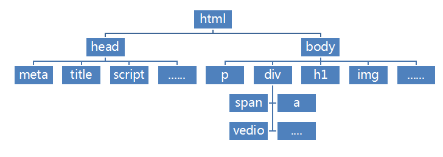

# HTML 理论知识点

超文本标记语言（Hyper Text Markup Language），它通过标记符号来标记要显示的网页中的各个部分。网页文件本身是一种文本文件，通过在文本文件中添加标记符，为其添加语义，可以告诉浏览器如何显示其中的内容（如：文字处理，画面安排，图片显示等）。  
**HTML 一句话，就是给文本添加语义的，在 HTML 标签的世界中，除了语义之外，其它的一概没有！**

## HTML 语义化

`HTML` 语义化是指根据内容的结构化（内容语义化）来选择合适的标签（代码语义化），即**用正确的标签做正确的事情**

::: tip 语义化的优点

`HTML` 语义化增强文档的可识别性

- 可以使页面在没有 `CSS` 样式表的情况下也能呈现出很好的内容结构
- 有利于 `SEO` 优化（爬虫依赖 `HTML` 的标签来确定渲染关键字的权重）
- 方便其他设备解析（屏幕阅读器、盲人阅读器）提升了用户体验
- 增强了代码的可读性和可维护性

:::

### 常用的语义化标签

- `<article>`：表示文章主体部分
- `<aside>`：表示跟文章主体不那么相关的部分，一般包含导航、广告等工具性质的内容
- `<details> 和 <summary>`：表示可以查看或隐藏的其他详细信息
- `<figure> 和 <figcaption>`：表示与文章相关的图像、照片等流内容
- `<footer>`：通常出现在尾部，包含作者信息、相关链接、版权信息等
- `<header>`：表示导航或者介绍性的内容
- `<h1> ~ <h6>`：表示文章中不同层级的标题
- `<main>`：表示文章的主要内容
- `<nav>`：表示导航
  - 在 `header` 中大多表示文章目录
  - 在 `aside` 中大多是关联页面或者是整站地图
- `<section>`：表示文章中的“节”或“段”
- `<time>`：表示日期或时间

`HTML5` 标签选择流程图


[HTML 中的语义 —— MDN](https://developer.mozilla.org/zh-CN/docs/Glossary/Semantics)

<style client>
.ele-box{
    padding: 20px 10px;
    margin-bottom: 20px;
    border: 1px solid #cfcfcf;
    border-radius: 4px;
}
.video-ele-box{
    min-height: 200px;
    padding: 0;
    display: flex;
    align-items: stretch;
    justify-content: center;
    width: 100%;
}
table {
    width: 100%;
    border: 1px solid #cfcfcf;
    border-radius: 2px;
}
table thead {
    background-color: #efefef;
}

.btn-group {
  width: 100%;
  margin-bottom: 10px;
}

.btn {
    font-size: 14px;
    text-decoration: none;
    text-align: center;
    border-width: 2px;
    border-style: solid;
    border-radius: 4px;
    border-color: #1B9AF7;
    line-height: 36px;
    padding: 0 20px;
    margin: 0;
    display: inline-block;
    appearance: none;
    cursor: pointer;
    box-sizing: border-box;
    transition-property: all;
    transition-duration: .3s;
    animation: glowing-primary 2s ease infinite 1s alternate;
}
.btn + .btn {
  margin-left: 10px;
}

@keyframes glowing-primary {
  from {
    -webkit-box-shadow: 0 0 0 rgba(27, 154, 247, 0.3);
            box-shadow: 0 0 0 rgba(27, 154, 247, 0.3); }
  50% {
    -webkit-box-shadow: 0 0 20px rgba(27, 154, 247, 0.8);
            box-shadow: 0 0 20px rgba(27, 154, 247, 0.8); }
  to {
    -webkit-box-shadow: 0 0 0 rgba(27, 154, 247, 0.3);
            box-shadow: 0 0 0 rgba(27, 154, 247, 0.3); } 
}

.bar{
    position: relative;
    width: 240px;
    height: 20px;
    background: white;
    cursor: pointer;
    border-radius: 5px;
    border: 1px solid gray;
}
.bar_content{
    width: 0px;
    height: 18px;
    background-color: gray;
    background-image: repeating-linear-gradient(-45deg,red,gold 30px,yellow 30px,green 60px);
    background-size: 600px 100%;
    animation: mymove 12s linear infinite;
    border-radius: 5px;
}
.bar_time{
    width:85px;
    height: 20px;
    line-height: 20px;
    text-align: right;
    position: absolute;
    right: -85px;
    top: 0;
}
@keyframes mymove{
    from{background-position: 0% 0%;}
    to{background-position: 600px 0%;}
}
</style>

## HTML 骨架结构

```html
<!DOCTYPE html>
<html>
  <head lang="en">
    <meta charset="utf-8" />
    <title>哔哩哔哩</title>
    <meta name="Keywords" content="HTML,CSS,博客" />
    <meta name="Description" content="HTML牛批！" />
    <link rel="icon" href="favicon.ico" />
  </head>
  <body>
    Hello World ！！！
  </body>
</html>
```

- `<!DOCTYPE html>` 文档类型声明：这句话是告诉浏览器我这是一个什么类型的文档，你要按照什么类型来给我渲染；
- `<html></html>` 作为文档根元素，包含一个不可见的 `head` 和一个可见的 `body`；
- `<head lang="en"></head>` 规定文档相关的通用信息（元数据），包括文档的标题，文档的样式和脚本的链接（定义）等，head 后面的 `lang="en"`是对语言进行设置；
- `<meta charset="utf-8" />` `<meta />`用来设置元数据内容，这里的`charset="utf-8"`表示字符集设置为**utf-8**；同理，下面的 `<meta name="Keywords" content="HTML,CSS,博客" />` 、`<meta name="Description" content="HTML牛批！" />` 分别表示关键字和描述，多用于 SEO 优化；
- `<title>哔哩哔哩</title>` 设置网页地址栏主标题；
- `<link rel="icon" href="favicon.ico" />` 指定了外部资源与当前文档的关系，多用于外链 css 文件。rel 是告诉浏览器我这是一个什么类型的外链东西，href 标明了链接这个东西的地址或者路径。这里的`rel="icon" href="favicon.ico"`是对网站的地址栏设置 logo；
- `<body></body>` 表示的是 HTML 文档的主体内容，也是我们最在意的部分，这部分会显示在浏览器上。任何一个 HTML 文档，只允许存在一个 `<body>` 元素。

html 结构如下图：



## HTML 标签

HTML 文档就是由一系列 HTML 元素定义的。这些元素由 HTML 标签包裹并为其添加语义，比如`<h1>我是标题</h1>`，文本内容 “我是标题” 因为被 h1 标签包裹，才让浏览器得知这是个标题，然后按照标题的样式渲染。  
一般来说标签都是**双标签**（如`<p></p>`、`<h1></h1>`等），但也有**单标签**（如``、`<br />`等）。不管是哪一种，标签都需要闭合。  
HTML 标签众多，详细的可以去 [W3school][2] 或者 [腾讯云-开发者手册][3] 查看详细。这里就不展开了。

虽然标签众多，但是早期的标签有许多并非单纯的表达语义的，比如 `<b></b>`、`<em></em>`等，只是改变了样式，这违背了之前添加语义的初衷，所以 HTML5 新标准中，许多标签被废弃。  
除了这些[被废弃的标签][4]，HTML5 中也新增了许多更具有语义化的标签，这里我们着重讲一讲这些有趣的[HTML5 新标签][1]。

这里介绍下 HTML5 中的网页多媒体标签，HTML5 通过 HTML 标签 `audio` 和 `video` 来支持嵌入式的媒体，使开发者能够方便地将媒体嵌入到 HTML 文档中。

#### audio

`audio` 是 HTML5 提供的播放音频文件的标准。

<div class="ele-box">
    <audio id="audioplayer" controls>
        <source src="http://music.163.com/song/media/outer/url?id=705376.mp3" type="audio/mpeg">
        您的浏览器不支持 audio 标签。
    </audio>
</div>

```html
<audio id="audioplayer" controls>
  <source src="music.ogg" type="audio/ogg" />
  <source src="music.mp3" type="audio/mpeg" />
  您的浏览器不支持 audio 标签。
</audio>
```

可以用 `<source/>` 标签来指定多个文件，以为不同的浏览提供可支持编码的格式。其支持一下 MIME 类型：

| Format | MIME-TYPE  |
| :----: | :--------: |
|  MP3   | audio/mpeg |
|  Ogg   | audio/ogg  |
|  Wav   | audio/wav  |

`audio` 常用到的属性包括以下几个:

- `controls` 显示音乐控件（播放，暂定，音量等控件）
- `autopaly` 自动播放
- `loop` 在播放完成后循环
- `preload` 在网页加载过程中加载音乐文件，有三个值可以设置，`"none"` 表示不缓冲；`"auto"` 表示缓冲音频文件；`metadata` 表示仅仅缓冲文件的元数据。如果设置了`autoplay`，则此属性无效。

到这里，`audio`的用法和属性基本就介绍完了，但是在使用的时候，因为实际需求和美观度，我们不会直接使用标签提供的控件，也不会直接展示标签。这就需要我们自定义了。下面我们就来介绍下`audio`标签的事件，然后去自定义一个音乐播放器吧！

<div class="ele-box">
    <div class="btn-group" role="group">
        <button type="button" id="play" class="btn btn-default">播放</button>
        <button type="button" id="pause" class="btn btn-default">暂停</button>
        <button type="button" id="stop" class="btn btn-default">停止播放</button>
        <button type="button" id="reset" class="btn btn-default">重置播放</button>
        <button type="button" id="stopvol" class="btn btn-default">静音</button>
    </div>
    <div style="display:flex;align-item:center;">
        <input type="range" style="max-width:300px;margin-top:20px;" name="vol" id="volbt" value="50" max="100" min="0"/>
        <span id="vol" style="display:inline-block;padding-left:20px;">50</span>
    </div>
</div>

```html
<button id="play">播放</button>
<button id="pause">暂停</button>
<button id="stop">停止播放</button>
<button id="reset">重置播放</button>
<button id="stopvol">静音</button>
<input type="range" name="vol" id="vol" value="50" max="100" min="0" /><span id="vol">50</span>
```

```js
var audioplayer = document.getElementById('audioplayer') //获取到播放器示例
// 获取各个自定义的按钮
var playbt = document.getElementById('play')
var stopbt = document.getElementById('stop')
var pause = document.getElementById('pause')
var resetbt = document.getElementById('reset')
var stopVolbt = document.getElementById('stopvol')
var volbt = document.getElementById('volbt')
var vol = document.getElementById('vol')
var flag = true //记录是否静音
var volValue = 0.5 //记录静音前 你的音量 音乐最大值是1，最小值是0

playbt.onclick = function () {
  //播放
  audioplayer.play()
}

pause.onclick = function () {
  //暂停
  audioplayer.pause()
}

stopbt.onclick = function () {
  //停止播放
  audioplayer.pause()
  audioplayer.currentTime = 0 //当前播放的时间
}

resetbt.onclick = function () {
  //重置播放
  stopbt.click()
  audioplayer.play()
}

stopVolbt.onclick = function () {
  // 静音
  if (flag) {
    audioplayer.volume = 0
    stopVolbt.innerText = '开启静音'
    volbt.value = 0
    vol.innerHTML = 0
  } else {
    audioplayer.volume = volValue
    stopVolbt.innerText = '静音'
    volbt.value = volValue * 100
    vol.innerHTML = volValue * 100
  }
  flag = !flag
}

volbt.oninput = function () {
  //音量控制
  vol.innerHTML = this.value
  audioplayer.volume = this.value / 100
  volValue = audioplayer.volume
}
```

这样，我们就通过自己定义的控件，实现对音乐的播放控制。但是只有这些还是不够的，音乐播放除了控件，我们还需要进度的显示、时间的显示，那我们继续来自定义进度。  
首先我们完成做一个进度条。

<div class="ele-box">
    <div id="a-bar" class="bar">
        <div id="a-bar_content" class="bar_content"></div>
        <div id="musicTime" class="bar_time"></div>
    </div>
</div>

```html
<!--进度条-->
<div id="a-bar" class="bar">
  <div id="a-bar_content" class="bar_content"></div>
  <div id="musicTime" class="bar_time"></div>
</div>
```

```css
.bar {
  position: relative;
  width: 240px;
  height: 20px;
  background: white;
  cursor: pointer;
  border-radius: 5px;
  border: 1px solid gray;
}
.bar_content {
  width: 0px;
  height: 18px;
  background-color: gray;
  background-image: repeating-linear-gradient(-45deg, red, gold 30px, yellow 30px, green 60px);
  background-size: 600px 100%;
  animation: mymove 12s linear infinite;
  border-radius: 5px;
}
.bar_time {
  width: 100px;
  height: 20px;
  line-height: 20px;
  text-align: right;
  position: absolute;
  right: -85px;
  top: 0;
}
@keyframes mymove {
  from {
    background-position: 0% 0%;
  }
  to {
    background-position: 600px 0%;
  }
}
```

再添加上对播放进度的监听和进度条拖动的事件。

```js
//获取进度条
var timer = null
var barContent = document.getElementById('a-bar_content')
var musicTime = document.getElementById('musicTime')
//进度条
function change() {
  musicTime.innerHTML = (function () {
    var t = Math.round(audioplayer.currentTime) // 当前已经播放的时间
    var dt = Math.round(audioplayer.duration) // 音乐的完整时间
    return Math.floor(t / 60) + ':' + (t % 60) + ' / ' + Math.floor(dt / 60) + ':' + (dt % 60)
  })()

  // 240为设计的进度条总长度
  barContent.style.width = (audioplayer.currentTime / audioplayer.duration) * 240 + 'px'
  if (audioplayer.currentTime === audioplayer.duration) {
    clearInterval(timer) // 播放结束
  } else {
    timer = setTimeout(change, 100)
  }
}
change()

//进度条方向控制
var bar = document.getElementById('a-bar')
bar.onclick = function (e) {
  const oEvent = e || window.event
  barContent.style.width = oEvent.offsetX + 'px'
  barContent.style.transition = 'width 0.1s ease'
  audioplayer.currentTime = (oEvent.offsetX / 240) * audioplayer.duration
}
```

最后别忘了在前面控件事件的地方加上对进度条的控制。做完这些，一个美（chou）观（lou）的播放器就完成了。当然，你完全可以发挥自己的设计能力，设计出一个更好看更实用的播放器，甚至可以加上歌词的滚动或是类似网易云音乐那样黑胶唱片播放的效果。

在这里，你可以选择播放的本地文件来测试下播放器。

<div class="ele-box">
    <div style="font-size:20px;font-weight:600;padding:10px 0;"> 文件：<span id="musicName"></span></div>
    <div><button id="btn" type="button" class="btn btn-default">选择文件</button></div>
    <input id="input_file" style="display: none;" type="file" value="" />
</div>

或者资源外链来测试。

<div class="ele-box">
    <div class="input-group input-group-sm">
      <input type="text" id="input_link" class="form-control" value="http://music.163.com/song/media/outer/url?id=705376.mp3" placeholder="请输入资源外链">
      <span class="input-group-btn">
        <button class="btn btn-default" id="btn2" type="button">Let's Go!</button>
      </span>
    </div>
</div>

这里顺便记录下，如何获取**网易云音乐有效永久外链**？
想获取一首歌的外链时，需要获取到歌曲的 ID。你可以在播放页面点击 **分享** -> **复制链接**，粘贴出来就能看到 ID 了。再将获取 ID 填入这个地址（`http://music.163.com/song/media/outer/url?id=你获取的ID.mp3`）中，就可以得到有效永久外链了。

#### video

`video` 标签定义视频，比如电影片段或其他视频流。

<div class="video-ele-box">
    <video id="videoplayer" poster="https://picsum.photos/600/350" controls width="100%" height="100%">
        <source src="https://www.apacara.com/media/video/myVideo.mp4" type="video/mp4" />
        <source src="https://www.apacara.com/media/video/myVideo.ogv" type="video/ogg" />
        <source src="https://www.apacara.com/media/video/myVideo.webm" type="video/webm" />
        <object width="800" height="500" type="application/x-shockwave-flash" data="video.swf">
            <param name="movie" value="myvideo.swf" />
            <param name="flashvars" value="autostart=true&amp;file=myvideo.swf" />
        </object>
        您的浏览器不支持 video 标签。
    </video>
</div>

```html
<video id="videoplayer" poster="poster.png" controls width="100%" height="100%">
  <source src="myvideo.mp4" type="video/mp4" />
  <source src="myvideo.ogv" type="video/ogg" />
  <source src="myvideo.webm" type="video/webm" />
  <source src="myvideo.rmvb" type="video/webm" />
  <object width="800" height="500" type="application/x-shockwave-flash" data="video.swf">
    <param name="movie" value="myvideo.swf" />
    <param name="flashvars" value="autostart=true&amp;file=myvideo.swf" />
  </object>
  您的浏览器不支持 video 标签。
</video>
```

可以用 `<source/>` 标签来指定多个文件，以为不同的浏览提供可支持编码的格式。其支持一下 MIME 类型：

| Format | MIME-TYPE  |
| :----: | :--------: |
|  MP4   | video/mp4  |
|  WebM  | video/webm |
|  Ogg   | video/ogg  |

`video` 常用到的属性与 `audio` 基本一致，包括一下几个：

- `controls` 显示音乐控件（播放，暂定，音量等控件）
- `autopaly` 自动播放
- `loop` 在播放完成后循环
- `poster` 视频封面海报
- `preload` 在网页加载过程中加载音乐文件，有三个值可以设置，`"none"` 表示不缓冲；`"auto"` 表示缓冲音频文件；`metadata` 表示仅仅缓冲文件的元数据。如果设置了`autoplay`，则此属性无效。

`video` 和 `audio` 都属于网页多媒体，属性和操作都十分类似。我们用同样的方式，来帮助理解自定义视频播放器。详细的这里就不做介绍了，直接放代码了！

<div class="ele-box">
    <div class="btn-group btn-group-sm" role="group">
        <button type="button" id="v-play" class="btn btn-default">播放</button>
        <button type="button" id="v-pause" class="btn btn-default">暂停</button>
        <button type="button" id="v-stop" class="btn btn-default">停止播放</button>
        <button type="button" id="v-reset" class="btn btn-default">重置播放</button>
        <button type="button" id="v-stopvol" class="btn btn-default">静音</button>
        <button type="button" id="v-full" class="btn btn-default">全屏</button>
    </div>
    <div style="display:flex;align-item:center;margin-bottom:20px;">
        <input type="range" style="max-width:300px;margin-top:20px;" id="v-volbt" value="50" max="100" min="0"/>
        <span id="v-vol" style="display:inline-block;padding-left:20px;">50</span>
    </div>
    <!--进度条-->
    <div id="v-bar" class="bar">
        <div id="v-bar_content" class="bar_content"></div>
        <div id="videoTime" class="bar_time"></div>
    </div>
</div>

```html
<button id="v-play">播放</button>
<button id="v-pause">暂停</button>
<button id="v-stop">停止播放</button>
<button id="v-reset">重置播放</button>
<button id="v-stopvol">静音</button><span id="v-vol">50</span>
<button id="v-full">全屏</button>
<input type="range" id="v-vol" value="50" max="100" min="0" />
<!--进度条-->
<div id="v-bar" class="bar">
  <div id="v-bar_content" class="bar_content"></div>
  <div id="videoTime" class="bar_time"></div>
</div>
```

```js
var videoplayer = document.getElementById('videoplayer')
var vPlaybt = document.getElementById('v-play')
var vStopbt = document.getElementById('v-stop')
var vPause = document.getElementById('v-pause')
var vResetbt = document.getElementById('v-reset')
var vVolbt = document.getElementById('v-volbt')
var vVol = document.getElementById('v-vol')
var vStopVolbt = document.getElementById('v-stopvol')
//获取进度条
var vTimer = null
var vBarContent = document.getElementById('v-bar_content')
var videoTime = document.getElementById('videoTime')
var vFlag = true //记录是否静音
var vVolValue = 0.5 //记录静音前 你的音量

//播放
vPlaybt.onclick = function () {
  videoplayer.play()
}
//暂停
vPause.onclick = function () {
  videoplayer.pause()
}
//停止播放
vStopbt.onclick = function () {
  videoplayer.pause()
  //当前播放的时间
  videoplayer.currentTime = 0
  vBarContent.style.width = 0
}
//重置
vResetbt.onclick = function () {
  vStopbt.click()
  videoplayer.play()
}
//音量控制
vVolbt.oninput = function () {
  //音乐最大值是1，最小值是0
  vVol.innerHTML = this.value
  videoplayer.volume = this.value / 100
  vVolValue = videoplayer.volume
}
// 静音
vStopVolbt.onclick = function () {
  if (vFlag) {
    videoplayer.volume = 0
    vStopVolbt.innerText = '开启'
    vVolbt.value = 0
    vVol.innerHTML = 0
  } else {
    videoplayer.volume = vVolValue
    vStopVolbt.innerText = '静音'
    vVolbt.value = vVolValue * 100
    vVol.innerHTML = vVolValue * 100
  }
  vFlag = !vFlag
}
//进度条
function vChange() {
  videoTime.innerHTML = (function () {
    var t = Math.round(videoplayer.currentTime)
    var dt = Math.round(videoplayer.duration)
    return Math.floor(t / 60) + ':' + (t % 60) + ' / ' + Math.floor(dt / 60) + ':' + (dt % 60)
  })()
  //videoplayer.duration 音乐的完整时间
  vBarContent.style.width = (videoplayer.currentTime / videoplayer.duration) * 240 + 'px'
  if (videoplayer.currentTime == videoplayer.duration) {
    clearInterval(vTimer)
  } else {
    vTimer = setTimeout(vChange, 100)
  }
}
vChange()
//进度条方向控制
var vBar = document.getElementById('v-bar')
vBar.onclick = function (e) {
  const oEvent = e || window.event
  vBarContent.style.width = oEvent.offsetX + 'px'
  vBarContent.style.transition = 'width 0.1s ease'
  videoplayer.currentTime = (oEvent.offsetX / 240) * videoplayer.duration
  videoplayer.play()
}
//全屏
var elem = document.getElementById('v-full')
elem.onclick = function () {
  if (elem.webkitRequestFullScreen) {
    videoplayer.webkitRequestFullScreen()
  } else {
    alert('您的浏览器不支持全屏。。快换电脑！！')
  }
}
```

同样的，你可以选择播放的本地文件来测试下播放器。

<div class="ele-box">
    <div style="font-size:20px;font-weight:600;padding:10px 0;"> 文件：<span id="videoName"></span></div>
    <div><button id="v-btn" type="button" class="btn btn-default">选择文件</button></div>
    <input id="v-input_file" style="display: none;" type="file" value="" />
</div>

或者资源外链来测试。

<div class="ele-box">
    <div class="input-group input-group-sm">
      <input type="text" id="v-input_link" class="form-control" value="" placeholder="请输入资源外链">
      <span class="input-group-btn">
        <button class="btn btn-default" id="v-btn2" type="button">Let's Go!</button>
      </span>
    </div>
</div>

有时候会出现视频无法自动播放。查找资料后发现，添加 `muted` 属性，就可以通过地址栏进入网页时自动播放了。

<script setup>
import { onMounted, nextTick } from 'vue';

function init() {
    //用来解决本地文件也可以拖拽进度条的问题
    var audioplayer = document.getElementById("audioplayer");
    var playbt = document.getElementById("play");
    var stopbt = document.getElementById("stop");
    var pause = document.getElementById("pause");
    var resetbt = document.getElementById("reset");
    var volbt = document.getElementById("volbt");
    var vol = document.getElementById("vol");
    var stopVolbt = document.getElementById("stopvol");
    var musicTime = document.getElementById("musicTime")
    //获取进度条
    var timer = null;
    var barContent = document.getElementById("a-bar_content");
    var flag = true;//记录是否静音
    var volValue = 0.5;//记录静音前 你的音量

    //播放
    playbt.onclick = function () {
        audioplayer.play();
    }
    //暂停
    pause.onclick = function () {
        audioplayer.pause();
    }
    //停止播放
    stopbt.onclick = function () {
        audioplayer.pause();
        //当前播放的时间
        audioplayer.currentTime = 0;
    }
    //重置
    resetbt.onclick = function () {
        stopbt.click();
        audioplayer.play();
        barContent.style.width = 0;
        musicTime.innerHTML = "0";
    }
    //音量控制
    volbt.oninput = function () {
        //音乐最大值是1，最小值是0
        vol.innerHTML = this.value;
        audioplayer.volume = this.value / 100;
        volValue = audioplayer.volume;
    }
    // 静音
    stopVolbt.onclick = function () {
        if (flag) {
            audioplayer.volume = 0;
            stopVolbt.innerText = "开启";
            volbt.value = 0;
            vol.innerHTML = volValue * 100;
        } else {
            audioplayer.volume = volValue;
            stopVolbt.innerText = "静音";
            volbt.value = volValue * 100;
            vol.innerHTML = volValue * 100;
        }
        flag = !flag;
    }

    //进度条
    function change() {
        musicTime.innerHTML = (function () {
            var t = Math.round(audioplayer.currentTime);
            var dt = Math.round(audioplayer.duration);
            return (Math.floor(t / 60) + ":" + t % 60 + " / " + Math.floor(dt / 60) + ":" + (dt % 60));
        })()

        //audioplayer.duration 音乐的完整时间  240为设计的进度条总长度
        barContent.style.width = audioplayer.currentTime / audioplayer.duration * 240 + "px";
        if (audioplayer.currentTime == audioplayer.duration) {
            clearInterval(timer);
        } else {
            timer = setTimeout(change, 100)
        }
    }
    change();
    //进度条方向控制
    var bar = document.getElementById("a-bar");
    bar.onclick = function (e) {
        const oEvent = e || window.event;
        barContent.style.width = oEvent.offsetX + "px";
        barContent.style.transition = "width 0.1s ease";
        audioplayer.currentTime = oEvent.offsetX / 240 * audioplayer.duration;
        audioplayer.play();
    }

    // 换资源
    var musicName = document.getElementById("musicName");
    var inputfile = document.getElementById("input_file");
    var btn = document.getElementById("btn");
    btn.onclick = function () {
        inputfile.click();
    }
    inputfile.onchange = function () {
        musicName.innerText = this.value
        var fileurl = URL.createObjectURL(this.files[0]);
        audioplayer.src = fileurl;
        audioplayer.play();
        change();
    }

    var inputLink = document.getElementById("input_link");
    var btn2 = document.getElementById("btn2");
    btn2.onclick = function () {
        musicName.innerText = null;
        if (inputLink.value) {
            audioplayer.src = inputLink.value;
            audioplayer.play();
            change();
            musicName.innerText = inputLink.value;
        } else {
            musicName.innerText = "请输入资源外链";
        }
    }


    // Video 部分 

    var videoplayer = document.getElementById("videoplayer");
    var vPlaybt = document.getElementById("v-play");
    var vStopbt = document.getElementById("v-stop");
    var vPause = document.getElementById("v-pause");
    var vResetbt = document.getElementById("v-reset");
    var vVolbt = document.getElementById("v-volbt");
    var vVol = document.getElementById("v-vol");
    var vStopVolbt = document.getElementById("v-stopvol");
    //获取进度条
    var vTimer = null;
    var vBarContent = document.getElementById("v-bar_content");
    var videoTime = document.getElementById("videoTime");
    var vFlag = true;//记录是否静音
    var vVolValue = 0.5;//记录静音前 你的音量

    //播放
    vPlaybt.onclick = function () {
        videoplayer.play();
    }
    //暂停
    vPause.onclick = function () {
        videoplayer.pause();
    }
    //停止播放
    vStopbt.onclick = function () {
        videoplayer.pause();
        //当前播放的时间
        videoplayer.currentTime = 0;
        vBarContent.style.width = 0;
    }
    //重置
    vResetbt.onclick = function () {
        vStopbt.click();
        videoplayer.play();
    }
    //音量控制
    vVolbt.oninput = function () {
        //音乐最大值是1，最小值是0
        vVol.innerHTML = this.value;
        videoplayer.volume = this.value / 100;
        vVolValue = videoplayer.volume;
    }
    // 静音
    vStopVolbt.onclick = function () {
        if (vFlag) {
            videoplayer.volume = 0;
            vStopVolbt.innerText = "开启";
            vVolbt.value = 0;
            vVol.innerHTML = 0;
        } else {
            videoplayer.volume = vVolValue;
            vStopVolbt.innerText = "静音";
            vVolbt.value = vVolValue * 100;
            vVol.innerHTML = vVolValue * 100;
        }
        vFlag = !vFlag;
    }
    //进度条
    function vChange() {
        videoTime.innerHTML = (function () {
            var t = Math.round(videoplayer.currentTime);
            var dt = Math.round(videoplayer.duration);
            return (Math.floor(t / 60) + ":" + t % 60 + " / " + Math.floor(dt / 60) + ":" + (dt % 60));
        })()
        //videoplayer.duration 音乐的完整时间
        vBarContent.style.width = videoplayer.currentTime / videoplayer.duration * 240 + "px";
        if (videoplayer.currentTime == videoplayer.duration) {
            clearInterval(vTimer);
        } else {
            vTimer = setTimeout(vChange, 100)
        }
    }
    vChange();
    //进度条方向控制
    var vBar = document.getElementById("v-bar");
    vBar.onclick = function (e) {
        const oEvent = e || window.event;
        vBarContent.style.width = oEvent.offsetX + "px";
        vBarContent.style.transition = "width 0.1s ease";
        videoplayer.currentTime = oEvent.offsetX / 240 * videoplayer.duration;
        videoplayer.play();
    }
    //全屏
    var elem = document.getElementById("v-full");
    elem.onclick = function () {
        if (elem.webkitRequestFullScreen) {
            videoplayer.webkitRequestFullScreen();
        } else {
            alert("您的浏览器不支持全屏。。快换电脑！！")
        }
    }

    // 换资源
    var videoName = document.getElementById("videoName");
    var vInputfile = document.getElementById("v-input_file");
    var vBtn = document.getElementById("v-btn");
    vBtn.onclick = function () {
        vInputfile.click();
    }
    vInputfile.onchange = function () {
        videoName.innerText = this.value
        var fileurl = URL.createObjectURL(this.files[0]);
        videoplayer.src = fileurl;
        videoplayer.play();
        vChange();
    }

    var vInputLink = document.getElementById("v-input_link");
    var vBtn2 = document.getElementById("v-btn2");
    vBtn2.onclick = function () {
        videoName.innerText = null;
        if (vInputLink.value) {
            videoplayer.src = vInputLink.value;
            videoplayer.play();
            vChange();
            videoName.innerText = vInputLink.value;
        } else {
            videoName.innerText = "请输入资源外链";
        }
    }
}

onMounted(() => {
    nextTick(() => {
        init()
    })
})
</script>

[1]: http://www.w3school.com.cn/html/html5_intro.asp
[2]: http://www.w3school.com.cn/html/html_elements.asp
[3]: https://cloud.tencent.com/developer/chapter/13536
[4]: https://cloud.tencent.com/developer/chapter/13538
