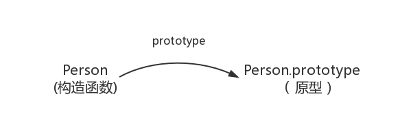
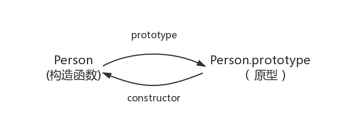
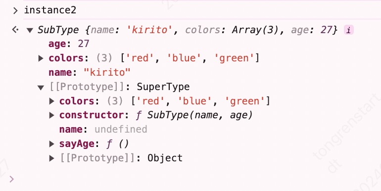
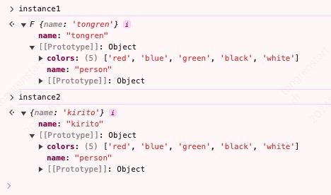
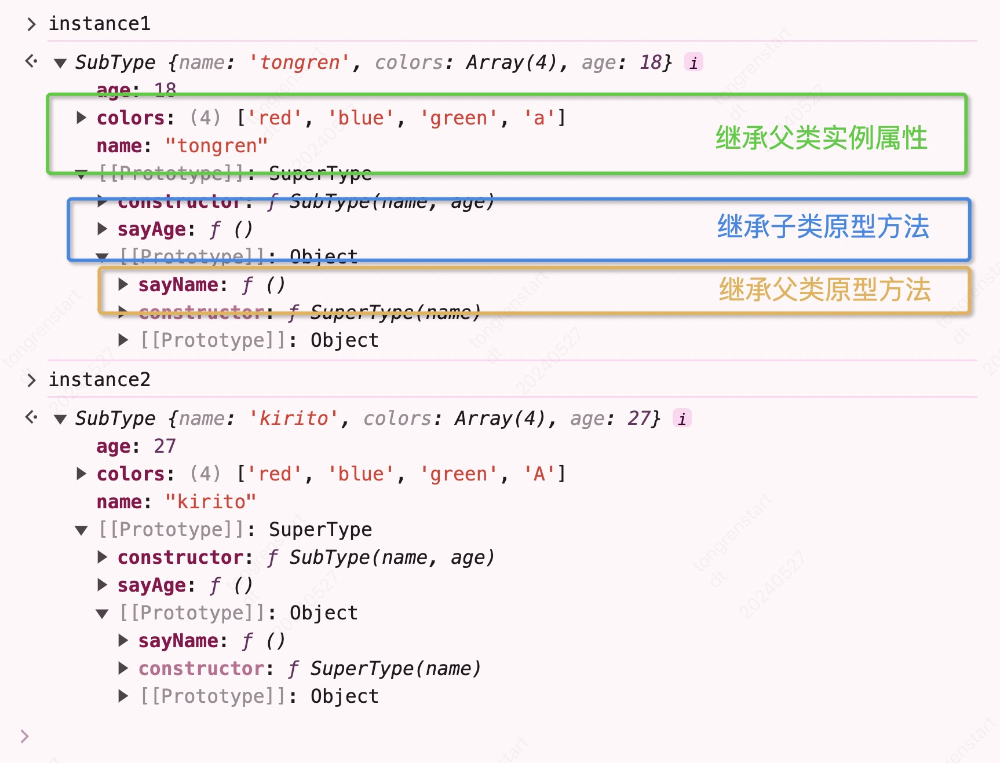

# 原型和原型链

原型和原型链是 `JavaScript` 中非常重要的概念，其对于理解 `JavaScript` 的对象模型和继承非常重要。通过原型和原型链，我们可以实现基于原型的继承、寄生式继承、组合式继承等多种继承方式，从而使代码更加简洁、易读、易于维护。

## 构造函数与实例

使用 `new` 运算符与构造函数是常用的创建对象的方式之一。构造函数是一种特殊的函数，用于创建新的对象实例，当我们使用 `new` 运算符调用一个函数时，它就成为了构造函数，因为它被用来构造一个新的对象实例

```js
// 构造函数
function Person(name) {
  this.name = name
}

// 对象实例
const person1 = new Person('tongren')
console.log(person1) // Person {name: 'tongren'}
```

::: tip 构造函数的特征

1. 函数名通常以大写字母开头，以便将其与普通函数区分开来（本质上没有任何区别）
   1. **使用 `new` 运算符生成实例的函数就是构造函数**
   2. **直接调用的函数就是普通函数**
2. 构造函数中通常使用 `this` 关键字来指代将要创建的对象实例
3. 构造函数中通常使用属性或方法来定义新对象实例的状态和行为

:::

## `prototype`

在 `JavaScript` 中，每个函数都有一个原型属性 `prototype`，其指向**调用该构造函数而创建的实例的原型**（原型可以是 `null` 或其他对象）



在原型对象（`prototype`）上定义的属性和方法会被对象实例共享

```js
function Person() {}

Person.prototype.name = 'tongren'

// 对象实例 person1
const person1 = new Person()
// 对象实例 person2
const person2 = new Person()

console.log(person1.name, person2.name) // 'tongren' 'tongren'
```

## `constructor`

每一个原型对象 `prototype` 都有一个 `constructor` 属性，其**指向原型的构造函数**

```js
function Person() {}
Person.prototype // { constructor: ƒ Person(name) }

Person.prototype.constructor === Person // true
```



## `__proto__`

在 `JavaScript` 中，每个对象都有一个 `__proto__` 属性，其**指向创建该对象的函数的 `prototype`**，即**构造函数的原型**（也称其为隐私原型）

::: warning `__proto__` 注意点

`__proto__` 用来读取或设置当前对象的原型对象，其本质上是一个内部属性，不是一个正式的对外的 `API`，只是由于浏览器广泛支持，才被加入了 `ES6` 以确保 `Web` 浏览器的兼容性，同时该属性已不推荐使用，在实际开发中更推荐使用 ES6 提供的 `JavaScript`

- 读取当前对象的原型对象
  - [Object.getPrototypeOf](https://developer.mozilla.org/zh-CN/docs/Web/JavaScript/Reference/Global_Objects/Object/getPrototypeOf)
  - [Reflect.getPrototypeOf](https://developer.mozilla.org/zh-CN/docs/Web/JavaScript/Reference/Global_Objects/Reflect/getPrototypeOf)
- 设置当前对象的原型对象
  - [Object.setPrototypeOf](https://developer.mozilla.org/zh-CN/docs/Web/JavaScript/Reference/Global_Objects/Object/setPrototypeOf)
  - [Reflect.setPrototypeOf](https://developer.mozilla.org/zh-CN/docs/Web/JavaScript/Reference/Global_Objects/Reflect/setPrototypeOf)

:::

```js
// 构造函数
function Person(name) {
  this.name = name
}

// 对象实例
const person = new Person('tongren')

person.__proto__ === Person.prototype // true
Object.getPrototypeOf(person) === Person.prototype // true
Reflect.getPrototypeOf(person) === Person.prototype // true
```


## 原型链

每个对象都拥有一个原型对象，通过 `__proto__` 指针指向上一个原型 ，并从中继承方法和属性，同时原型对象也可能拥有原型，这样一层一层，最终指向 `null`。这个**链式结构**被称为**原型链**。


::: tip `Object.prototype.__proto__ === null`
`Object.prototype` 是 `JavaScript` 中所有对象的原型。其定义了所有 `JavaScript` 对象都可以使用的属性和方法，例如 `toString()` `hasOwnProperty()` 等<br />
同时 `Object.prototype` 自身也是一个对象，因此它也有一个原型，而该原型是 `null`，这是 `JavaScript` 原型链的顶部。因此 `Object.prototype.__proto__ === null`（为了让原型链有终点）
:::

通过原型链一个对象会拥有定义在其他对象中的属性和方法，从而使得对象之间可以共享属性和方法，从而避免重复代码的出现。

所以当我们尝试访问一个对象的属性时，`JavaScript` 首先在对象本身中查找该属性。如果它没有找到该属性，它会继续在对象的原型中查找，然后在原型的原型中查找，以此类推，直到找到该属性或原型链的顶部

## `Object` 和 `Function`

> 都是给自己看的结论和总结

### 引用类型都是对象

在 `JavaScript` 中**一切引用类型都是对象（函数是一种函数对象）**，对象是属性的集合

> 即引用类型都是 `Object` 的子类

```js
/* 为对象定义属性 */
const obj = { a: 'obj' }

/* 为数组定义属性 */
const arr = []
arr.a = 'arr' // 'arr'

/* 为函数定义属性 */
const fn = function () {}
fn.a = 'fn' // 'fn'
```

### `Function`

`ECMAScript` 上的定义（[15.3.3](http://www.ecma-international.org/ecma-262/5.1/#sec-15.3.3)）

> The Function constructor is itself a Function object and its [[Class]] is "Function". The value of the [[Prototype]] internal property of the Function constructor is the standard built-in Function prototype object.

`Function` 构造函数是一个函数对象，其 `[[Class]]` 属性是 `Function`。`Function` 的 `[[Prototype]]`（即`__proto__`）属性指向了 `Function.prototype`

::: tip `Function.prototype` 注意点

`Function.prototype` 是一个函数，但其没有 `prototype`，同时 `Function.prototype.bind()` 方法创建的函数对象也没有 `prototype`

```js
typeof Function.prototype // 'function'

const fn = Function.prototype.bind()
// ƒ () { [native code] }

fn.prototype // undefined
```

`Function.prototype` 是引擎创建出来的函数，引擎认为不需要给这个函数对象添加 `prototype` 属性，不然 `Function.prototype.prototype` 将无休无止并且没有存在的意义

:::

同时每个 `JavaScript` 函数实际上都是一个 `Function` 对象，即 `Function` 的实例

所以会有这些奇怪的现象

```js
Function instanceof Object // true
// 实际如下
Object.__proto__ === Function.prototype // true

Object instanceof Function // true
// 实际如下
Function.__proto__.__proto__ === Object.prototype // true

Function instanceof Function // true
// 实际如下
Function.__proto__ === Function.prototype // true
```

> 经典图


- 所有的引用类型（数组、对象、函数）都是对象（对象是属性的集合）
- 所有的函数都是 `Function` 的实例
- `Object.prototype` 和 `Function.prototype` 均由引擎根据 `ECMAScript` 规范创建的两个特殊对象
- 所有的函数都有一个 `prototype` 属性（原型）指向调用该构造函数而创建的实例的原型
- 所有的对象都有一个 `__proto__` 属性（隐式原型）指向创建该对象的函数的 `prototype`（实例的隐式原型 === 构造函数的原型）
- 每个对象都拥有一个原型对象，通过 `__proto__` 指针指向上一个原型 ，同时原型对象也可能拥有原型，这样一层一层，最终指向 `null`。这个**链式结构**被称为**原型链**

## 继承

::: tip 温馨提示
阅读[《JavaScript 高级程序设计（第 4 版）》](https://www.ituring.com.cn/book/2472)和各个大佬的文章所归纳的总结，**如有异议按你的理解为主**
:::

继承是面向对象编程中的一个最为人津津乐道的概念，其描述了类与类之间的父子关系，主要作用是提升代码复用性让代码更为简洁。

很多面向对象语言都支持两种继承：

- 接口继承：只继承方法签名
- 实现继承：直接继承实际的方法

接口继承在 `ECMAScript` 中是不可能的，因为函数没有签名，因此实现继承是 `ECMAScript` 唯一支持的继承方式，而且其**实现继承主要是依靠原型链来实现**的。

### 原型链继承

构造函数、原型和实例的关系：每个构造函数都有一个原型对象，原型有一个属性指回构造函数，而实例有一个内部指针指向原型。如果原型是另一个类型的实例呢？那就意味着这个原型本身有一个内部指针指向另一个原型，相应地另一个原型也有一个指针指向另一个构造函数。这样就在实例和原型之间构造了一条原型链。这就是原型链的基本构想

::: tip 原型链继承

原型链继承是通过重写子类的原型**将父类的实例作为子类的原型**

缺点

- 父类上的引用类型属性会被所有实例共享，其中一个实例进行修改时会影响其他实例
- 创建子类实例时不能向父类构造函数传参

:::

```js {14,23,28}
function SuperType() {
  this.property = 'Super'
  this.colors = ['red', 'blue', 'green']
}

SuperType.prototype.getSuperValue = function () {
  return this.property
}

function SubType() {
  this.subproperty = false
}

// 关键点：创建父类 SuperType 的实例并将其赋值给子类的原型 SubType.prototype
SubType.prototype = new SuperType()

SubType.prototype.getSubValue = function () {
  return this.subproperty
}

const instance1 = new SubType()
console.log('instance1', instance1.getSuperValue()) // 'Super'
// 在其中一个子类实例上修改父类上的引用属性
instance1.colors.push('black')

const instance2 = new SubType()
console.log('instance2', instance2.getSuperValue()) // 'Super'
// 在另一个子类实例上输出父类上的引用属性
console.log('instance2', instance2.colors) // ['red', 'blue', 'green', 'black']
```

### 借用构造函数继承（经典继承）

::: tip 借用构造函数继承（经典继承）

借用构造函数继承是**使用父类的构造函数来增强子类实例**等同于复制父类的实例给子类（不使用原型）

缺点

- 方法都在构造函数中定义，每次创建实例都会创建一遍方法（影响性能）
- 只能继承父类的实例属性和方法，不能继承原型属性和方法

:::

```js
function SuperType(name) {
  this.name = name
  this.colors = ['red', 'blue', 'green']
  this.log = function () {
    console.log(this.name)
  }
}

function SubType(name) {
  // 继承 SuperType
  SuperType.call(this, name)
}

const instance1 = new SubType('tongren')
instance1.colors.push('black')
console.log('instance1', instance1.name) // 'tongren'
console.log('instance1', instance1.colors) // ['red', 'blue', 'green', 'black']

const instance2 = new SubType('kirito')
console.log('instance2', instance2.name) // 'kirito'
console.log('instance2', instance2.colors) // ['red', 'blue', 'green']

console.log(instance1.log === instance2.log) // false
```

### 组合继承

::: tip 组合继承

组合继承（有时候也叫伪经典继承）是上面两种继承的组合，将两者的优点集中了起来。基本的思路是**使用原型链继承原型上的属性和方法，通过借用构造函数来实现对实例属性的继承**。这样既可以把方法定义在原型上实现函数复用，又可以让每个实例都有其自己的属性

- 优点：弥补了原型链和借用构造函数的不足，**是 `JavaScript` 中使用最多的继承模式**。而且组合继承也保留了 `instanceof` 操作符和 `isPrototypeOf()` 方法识别合成对象的能力
- 缺点：由于调用了两次父类的构造函数，导致父类中的实例属性和方法既存在于子类的实例中又存在于子类的原型中

:::

```js
function SuperType(name) {
  // 定义属性
  this.name = name
  this.colors = ['red', 'blue', 'green']
}
// 定义方法
SuperType.prototype.sayName = function () {
  console.log(this.name)
}

function SubType(name, age) {
  // 继承属性（第二次调用：创建子类实例时调用）
  SuperType.call(this, name)
  this.age = age
}

// 继承方法（第一次调用：给子类原型赋值时调用）
SubType.prototype = new SuperType()
SubType.prototype.constructor = SubType
SubType.prototype.sayAge = function () {
  console.log(this.age)
}

const instance1 = new SubType('tongren', 18)
instance1.colors.push('black')
console.log('instance1', instance1.colors) // ['red', 'blue', 'green', 'black']
instance1.sayName() // 'tongren'
instance1.sayAge() // 18

const instance2 = new SubType('kirito', 27)
console.log('instance2', instance2.colors) // ['red', 'blue', 'green']
instance2.sayName() // 'kirito'
instance2.sayAge() // 27
```

组合继承缺点图解



### 原型式继承

::: tip 原型式继承

原型式继承是**利用一个空对象作为中介，将某个对象直接赋值给空对象构造函数的原型**

缺点（和原型链继承一样）

- 引用类型属性会被所有实例共享，其中一个实例进行修改时会影响其他实例
- 无法传递参数
- 每次创建对象都会创建一遍方法

:::

```js
// 借用临时构造函数，将传入的对象作为其原型对象并返回其实例
function object(obj) {
  function F() {}
  F.prototype = obj
  return new F()
}
```

`object()` 方法就是 `ES5` `Object.create` 的模拟实现：**将传入的对象作为创建的对象的原型**

```js
const person = {
  name: 'person',
  colors: ['red', 'blue', 'green']
}
const instance1 = object(person)
instance1.name = 'tongren'
instance1.colors.push('black')

const instance2 = Object.create(person)
instance2.name = 'kirito'
instance2.colors.push('white')
console.log(person.colors) // ['red', 'blue', 'green', 'black', 'white']
```

::: warning 注意点

修改 `instance1.name` 时，`instance2.name` 的值并未发生改变，并不是因为 `instance1` 和 `instance2` 有独立的 `name` 值，而是因为 `instance1.name = 'tongren'` 是给 `instance1` 添加了 `name` 值，并非修改了原型上的 `name` 值



:::

### 寄生式继承

::: tip 寄生式继承

寄生式继承和原型式继承比较接近，其主要实现**是创建一个实现继承的函数，以某种方式增强对象，然后返回这个对象**

缺点

- 引用类型属性会被所有实例共享，其中一个实例进行修改时会影响其他实例
- 无法传递参数
- 每次创建对象都会创建一遍方法

:::

```js
function createAnother(original) {
  // 通过 Object.create 创建一个新对象
  const clone = Object.create(original)

  // 以某种方式增强这个对象（新增属性和方法）
  clone.sayHi = function () {
    console.log('hi')
  }

  // 返回这个对象
  return clone
}

const person = {
  name: 'person',
  colors: ['red', 'blue', 'green']
}

const instance1 = createAnother(person)
instance1.colors.push('black')
instance1.sayHi() // 'hi'

const instance2 = createAnother(person)
instance2.sayHi() // 'hi'
console.log('instance2', instance2.colors) // ['red', 'blue', 'green', 'black']

console.log(instance1.sayHi === instance2.sayHi) // false
```

### 寄生组合式继承

::: tip 寄生组合式继承
寄生组合式继承对组合继承进行了改良，优化调用两次父类构造函数的问题，就得到了一个 `ES6` 之前最佳的继承方式：**通过借用构造函数继承属性，再使用寄生式继承来继承父类原型，然后将返回的新对象赋值给子类原型**

优点：只调用一次父类构造函数，并且因此避免了在父类原型上面创建不必要的、多余的属性。与此同时原型链还能保持不变；因此还能够正常使用 `instanceof` 和 `isPrototypeOf`
:::

```js
function inheritPrototype(subType, superType) {
  // 创建对象：创建父类原型的一个副本
  const prototype = Object.create(superType.prototype)
  // 增强对象：解决因重写原型导致默认 constructor 丢失的问题
  prototype.constructor = subType
  // 指定对象：将新创建的对象赋值给子类的原型
  subType.prototype = prototype
}

// 父类初始化实例属性和原型属性
function SuperType(name) {
  this.name = name
  this.colors = ['red', 'blue', 'green']
}
SuperType.prototype.sayName = function () {
  alert(this.name)
}

// 借用构造函数传递增强子类实例属性（支持传参和避免篡改）
function SubType(name, age) {
  SuperType.call(this, name)
  this.age = age
}

// 将父类原型指向子类
inheritPrototype(SubType, SuperType)

// 新增子类原型属性
SubType.prototype.sayAge = function () {
  alert(this.age)
}

const instance1 = new SubType('tongren', 18)
instance1.colors.push('a') // ['red', 'blue', 'green', 'a']

const instance2 = new SubType('kirito', 27)
instance2.colors.push('A') // ['red', 'blue', 'green', 'A']
```



### ES6 类继承 extends

> `ES6` 的 `class` 只是**一个语法糖本质上依然是函数**，它的绝大部分功能，`ES5` 都可以做到，新的 `class` 写法只是让对象原型的写法更加清晰、更像面向对象编程的语法而已

`class` 可以通过 `extends` 关键字实现继承，让子类继承父类的属性和方法。`extends` 的写法比 `ES5` 的原型链继承，要清晰和方便很多

```js
class Point {
  constructor(x, y) {
    this.x = x
    this.y = y
  }
  toString() {
    return this.x + '' + this.y
  }
}

class ColorPoint extends Point {
  constructor(x, y, color) {
    super(x, y) // 调用父类的 constructor(x, y)
    this.color = color
  }

  toString() {
    return this.color + ' ' + super.toString() // 调用父类的 toString()
  }
}

const colorPoint = new ColorPoint('1', '2', 'red')
console.log(colorPoint.toString()) // red 12
```

::: tip ES5 和 ES6 的继承机制

- `ES5` 的继承机制
  - 先创造一个独立的子类的实例对象，然后再将父类的方法添加到这个对象上面，即**实例在前，继承在后**
- `ES6` 的继承机制
  - 先将父类的属性和方法，加到一个空的对象上面，然后再将该对象作为子类的实例，即**继承在前，实例在后**

:::

[通过 babel 编译来了解其背后的实现原理](https://babeljs.io/repl/#?browsers=&build=&builtIns=false&corejs=false&spec=false&loose=true&code_lz=MYGwhgzhAEAKD2BLAdgF2gbwFDWseyEqATgK7CrzEAUAHgDTQCeAlJjrtKgBaIQB0taAF5otDrh59-TEcw4BfLEqyhIMAMLwQVBCnQBTWqgPIAJjD1p2ufIRLlKNBs0b4dxNtk7QIpAA4GzoysEly8Au5UclHEispAA&debug=false&forceAllTransforms=false&shippedProposals=false&circleciRepo=&evaluate=true&fileSize=false&timeTravel=false&sourceType=module&lineWrap=false&presets=env&prettier=false&targets=&version=7.15.3&externalPlugins=&assumptions=%7B%7D)

```js
// 实现继承（类似于 ES5 的寄生组合式继承）
function _inheritsLoose(subClass, superClass) {
  subClass.prototype = Object.create(superClass.prototype)
  subClass.prototype.constructor = subClass
  _setPrototypeOf(subClass, superClass)
}

// 模拟 ES6 的 Reflect.setPrototypeOf 方法
function _setPrototypeOf(o, p) {
  _setPrototypeOf =
    Object.setPrototypeOf ||
    function _setPrototypeOf(o, p) {
      o.__proto__ = p
      return o
    }
  return _setPrototypeOf(o, p)
}

// 父类构造函数
var Point = function Point(x, y) {
  this.x = x
  this.y = y
}

// 子类构造函数
var ColorPoint = /*#__PURE__*/ (function (_Point) {
  _inheritsLoose(ColorPoint, _Point)

  function ColorPoint(x, y, color) {
    var _this

    _this = _Point.call(this, x, y) || this
    _this.color = color
    return _this
  }

  return ColorPoint
})(Point)
```

- 原型链继承：通过重写子类的原型**将父类的实例作为子类的原型**
- 借用构造函数继承：**使用父类的构造函数来增强子类实例**等同于复制父类的实例给子类（不使用原型）
- 组合继承：**使用原型链继承原型上的属性和方法，通过借用构造函数来实现对实例属性的继承**
- 原型式继承：**利用一个空对象作为中介，将某个对象直接赋值给空对象构造函数的原型**
- 寄生式继承：**创建一个实现继承的函数，以某种方式增强对象，然后返回这个对象**
- 寄生组合式继承：**通过借用构造函数继承属性，再使用寄生式继承来继承父类原型，然后将返回的新对象赋值给子类原型**

## 相关文章

- [深入理解 javascript 原型和闭包](https://www.cnblogs.com/wangfupeng1988/p/3977924.html)
- [Javascript Object Hierarchy](http://www.mollypages.org/tutorials/js.mp)
- [JavaScript 世界万物诞生记](https://zhuanlan.zhihu.com/p/356980105)
- [从探究 `Function.__proto__ === Function.prototype` 过程中的一些收获](https://github.com/jawil/blog/issues/13)
- [深入探究 Function & Object 鸡蛋问题](https://github.com/yygmind/blog/issues/35)
- [JavaScript 常用八种继承方案](https://github.com/yygmind/blog/issues/7)
- [JavaScript 深入之继承的多种方式和优缺点](https://github.com/mqyqingfeng/Blog/issues/16)
- [ES6 系列之 Babel 是如何编译 Class 的(下)](https://github.com/mqyqingfeng/Blog/issues/106)
