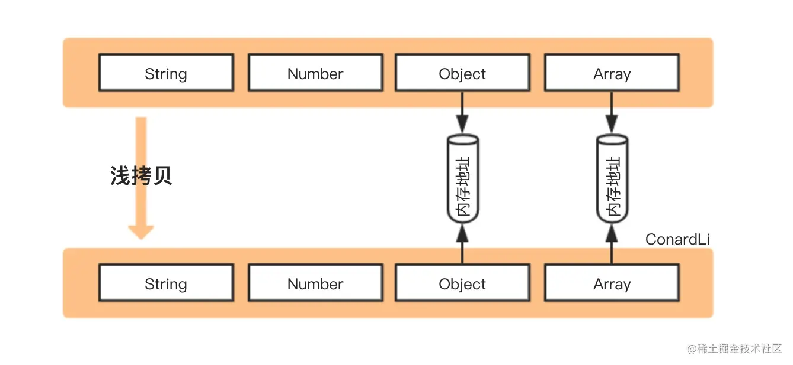
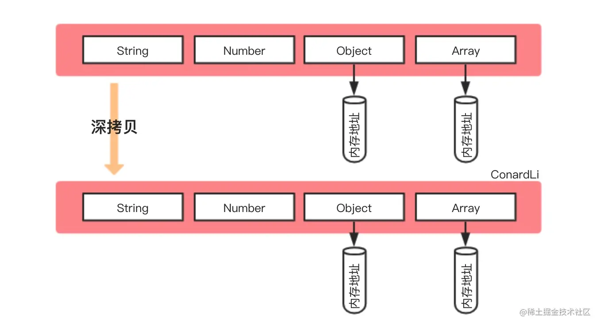

# 数据类型

::: tip 温馨提示
阅读[《JavaScript 高级程序设计（第 4 版）》](https://www.ituring.com.cn/book/2472)和各个大佬的文章所归纳的总结，**如有异议按你的理解为主**
:::

`JavaScript` 中的数据类型分为基本数据类型和引用数据类型

## 基本类型

> 注: 基本数据类型也可以叫原始数据类型

在 `ES2020` 标准下的 `JavaScript` 一共有以下 7 种基本类型

- **`undefined`** 未定义
- **`null`** 空指针
- **`boolean`** 布尔值
- **`string`** 字符串
- **`number`** 数值
- **`symbol`** 独一无二的值 ([ES6 引入](https://es6.ruanyifeng.com/#docs/symbol))
- **`bigint`** 大整数 ([ES2020 引入](https://es6.ruanyifeng.com/#docs/number#BigInt-%E6%95%B0%E6%8D%AE%E7%B1%BB%E5%9E%8B))

::: tip 基本类型总结

- 基本类型仅保存原始值，不存在属性和方法
- 基本类型存储在 **栈内存** 中
- 保存基本类型的变量是 **按值 (by value) 访问** 的，操作的就是存储在变量中的实际值
- 复制基本类型时会创建该值的第二个副本 (独立使用，互不干扰)

:::

::: tip 为什么原始值不存在属性和方法，但 'hello world'.toString() 可以正确执行
为了方便操作原始值 `ECMAScript` 提供了 3 种特殊的引用类型：`Boolean` `Number` `String`，每当用到某个原始值的方法或属性时，后台都会创建一个相应原始包装类型的对象，在执行完后再销毁这个包装对象
:::

```js
// 举个 🌰
const str = 'hello world'
str.toString()
str.length

/**
 * 在执行上面的代码时 `JavaScript` 都会执行以下 3 步
 * 1. 创建一个 String 类型的实例
 * 2. 调用实例上的特定方法或属性
 * 3. 销毁刚刚创建的实例
 */
const str = 'hello world'
new String(str).toString()
new String(str).length
```

### 字符串 String

字符串是 JavaScript 中，最基本的值类型之一。详细的介绍请参考 W3C 的[String 对象](http://www.w3school.com.cn/jsref/jsref_obj_string.asp)。

> String 对象用于处理文本（字符串）。

#### 初始化

初始化字符串，可以分为两种，字面量和构造函数。

```js
// 1. 字面量方式 双引号或单引号都代表的是字符串
var str = 'hello world !'
var str1 = 'welcome to my blog !'
typeof str // String

// 2. 构造函数
var str2 = new String('hello world !')
typeof str2 //object
```

在 JavaScript 中 `String` 类型的的字符串也可以使用 `Object` 类型中包含的属性和方法，js 会默认的将 `String` 类型转换成 `Object`。

#### length 和获取字符

对字符串而言，是由一个一个的字符拼接而成，可以说，字符是字符串的基本单位。但是 JavaScript 中，没有字符串和字符的区别。对比 Java 中，就明显很多，字符只能用单引号，字符串只能用双引号。

```js
var str = 'abcdefg'
// length 计算字符串的长度
console.log(str.length) // 7

// charAt() 返回特定索引位置的字符 默认为0
console.log(str.charAt()) // a
// charCodeAt() 返回特定位置字符在Unicode码中的十进制数 默认为0
console.log(str.charCodeAt()) // 97

// Unicode码转字符
// A-Z对应65-90  a-z对应97-122
var c = String.fromCharCode(65)
console.log(c) // A
```

详细的 Unicode 码比较多，这里展示其中一部分，如 ASCII 码对应的十进制数，可以参考下图。


#### 字符串的常用方法

```js
// indexOf() 从前到后检索子串，返回子串开始位置的索引，无此子串返回-1
var str = 'hello world hello world hello world'
var position = str.indexOf('hello')
console.log(position) // 0
// 如果传入第二个参数（正整数），第二个参数为开始查找的位置，查找方向不变
var position2 = str.indexOf('hello', 35) // -1
console.log(position2)

// lastIndexOf() 从后到前检索子串，返回子串开始位置的索引，无此子串返回-1
var position3 = str.lastIndexOf('hello')
console.log(position3) // 24

// toUpperCase() 原串中所有字母变成大写，新串返回
var str2 = 'hello WORLD'
var str3 = str2.toUpperCase()
console.log(str2) // hello WORLD
console.log(str3) // HELLO WORLD

// toLowerCase() 原串中所有字母变成小写，新串返回
var str4 = str2.toLowerCase()
console.log(str4) // hello world

// concat() 拼接字符串，和 + 一致
var str5 = 'hello'
var str6 = ' world'
var str7 = str5.concat(str6) // hello world
console.log(str7 + '-----' + str5) // hello world-----hello

// localeCompare() 用本地特定的顺序(0123456789aAbB.....zZ)来比较两个字符串 小 -1；等 0；大 1
var str8 = 'A'
var str9 = 'a'
console.log(str8.localeCompare(str9)) // 1

// slice() 提取字符串的片断，并在新的字符串中返回被提取的部分。
var str10 = 'abcdefg'
//正数时  参数1 起始位置 参数2 结束位置后一位
console.log(str10.slice(3, 5)) // de
//负数时  参数1 加长度（转正）参数2 加长度（转正）
console.log(str10.slice(-2, -1)) // f

// substring() 提取字符串中两个指定的索引号之间的字符。
//正数时  参数1 起始位置 参数2 结束位置后一位
console.log(str10.substring(3, 5)) // de
//负数时  参数1 置0 参数2 置0 相当于str10.substring(0, 0)
console.log(str10.substring(-1, -5)) // ""

// substr() 从起始索引号提取字符串中指定数目的字符。
//正数时  参数1 起始位置 参数2 返回新串的长度
console.log(str10.substr(3, 2)) // de
//负数时  参数1 加长度 参数2 置0
console.log(str10.substr(-3, 2)) // ef
```

> String 对象的方法 slice()、substring() 和 substr() （不建议使用）都可返回字符串的指定部分。slice() 比 substring() 要灵活一些，因为它允许使用负数作为参数。slice() 与 substr() 有所不同，因为它用两个字符的位置来指定子串，而 substr() 则用字符位置和长度来指定子串。

#### 字符串与数组的转换

实际运用中，会经常涉及数组与字符串之间的互相转换问题。

```js
var str = 'hello world welcome to my blog'
// 字符串 --> 数组
// 参数1 分隔符 参数2 个数限制
var arr = str.split(' ', 2)
console.log(arr) // ["hello", "world"]
// 数组 --> 字符串
// 参数1 连接符
var str2 = arr6.join('*')
console.log(str2) // "hello*world"
var str3 = arr6.toString()
console.log(str3) // "hello,world"
```

#### 字符串与数值的转换

数值类型 `Number` 和 字符串 `String` 之间的转换，在实际应用中十分广泛。在学习的时候，严格按照类型来处理是很重要的。

```js
//  字符串 --> 数值
// 【方法一】Number() 构造函数法
// 纯数值字符串，直接输出对应整型或浮点型；数值字符串前有0，忽略0
Number('-999.99') // -999.99
// 布尔值，真转成1，假转成0
Number(true) // 1
// undefined，转成NaN（Not a Number 非数值）, NaN自身不等（NaN!==NaN）
Number(undefined) // NaN
// 非纯数值字符串，空串转化成0；其他，转NaN
Number('1234abc') // NaN

// 【方法二】parseInt()/parseFloat() 官方提供函数用于将字符串转化为数值
// 如果第一个字符不是数值字符，返回NaN
parseInt('a123456') // NaN
// 如果第一个字符是数值字符串，检测第二个……，直到检测到非数值字符，然后将前面数值部分返回
parseInt('1234abc') // 1234
parseInt('12.34') // 12
// 对于含小数点的字符串，可以用parseFloat转换为浮点型
parseFloat('12.34') // 12.34
// 小数点数量超过一个时，只保留第一个小数点后和第二个小数点前的部分
parseFloat('12.34.56') // 12.34

// 【方法三】隐式转换 只能是纯数值字符串或者空字符串
var str = '123'
console.log(+str) // 123

//  数值 --> 字符串
// 【方法一】toString() 官方提供的方法
var num = 123
num.toString() // "123"
// 数值toString方法 也可以接受一个参数，转换为对应进制的字符串 默认为十进制
var num1 = 3
num.toString() // "3" 十进制
num.toString(2) // "11" 二进制

// 【方法二】隐式转换
var num = 100
console.log('' + num) // "100"
```

字符串的应用是 JavaScript 中最基本的部分之一，需要对基本的属性、方法有一定认识，才能为以后更深入的学习 JavaScript 做铺垫。

## 引用类型

在 `JavaScript` 中除了基本类型，其他的都是引用类型，常见的引用类型如下

- **`Object`** 对象
- **`Array`** 数组
- **`Function`** 函数
- **`Date`** 日期与时间
- **`RegExp`** 正则表达式
- **`Set`** 类似于数组但成员的值都是唯一的 ([ES6 引入](https://es6.ruanyifeng.com/#docs/set-map#Set))
- **`WeakSet`** ([ES6 引入](https://es6.ruanyifeng.com/#docs/set-map#WeakSet))
- **`Map`** 类似于对象也是键值对的集合 ([ES6 引入](https://es6.ruanyifeng.com/#docs/set-map#Map))
- **`WeakMap`** ([ES6 引入](https://es6.ruanyifeng.com/#docs/set-map#WeakMap))

::: tip 引用类型总结

- 因为 `JavaScript` 不允许直接访问内存位置(不能直接操作对象所在的内存空间)，所以引用类型在 **栈内存** 中存储的是地址(内存指针)，而引用类型中的数据(方法或属性)是存储在 **堆内存** 中
- 保存引用类型的变量是 **按引用 (by reference) 访问** ，实际上操作的是对该对象的引用而非实际的对象本身
- 复制引用类型时只会复制内存指针

:::

::: tip 栈内存和堆内存

- **栈内存**
  - 存储基本数据类型和堆内存地址
  - 是连续的内存空间
- **堆内存**
  - 存储引用数据类型和闭包中的变量
  - 不是连续的内存空间
- 了解更多请点击 [JS 中的栈内存和堆内存](https://github.com/chenqf/frontEndBlog/issues/9)

:::

### 数组 Array

数组 `Array` 官方定义的一个类型，存若干数据（有序），数组相关的基础知识整理。详细的可以查看[W3C 的相关介绍](http://www.w3school.com.cn/jsref/jsref_obj_array.asp)。

> Array 对象用于在单个的变量中存储多个值。

##### 初始化

初始化一个数组的方式有两种，字面量和构造函数。

```js
// 1. 字面量创建
var arr = [] // 创建了一个空数组
var arr1 = [1, , 'abc', true, 3.14]
console.log(arr1) // 第二个元素是 undefined

// 2. 构造函数创建
var arr2 = new Array() // [] 创建了一个空数组
arr2 = new Array(1, 2, 3) // [1,2,3]
//看一下变量的类型
console.log(typeof arr1) // object
console.log(typeof arr2) // object

//当只传一个参数的时候，若果是一个数字，创建一个长度为这个数字的数组
var arr3 = new Array(20) // 不是[20]，是创建一个长度为20的数组
console.log(arr3.length, arr3) // 20  []

//如果是负值，会报错
// arr3 = new Array(-2);
// Array.html:30 Uncaught RangeError: Invalid array length
console.log(arr3)
```

##### length

`length` 是数组的可读可写的属性。

```js
var arr4 = [1, 2, 3, 4]
// js中数组不存在数组越界
// 可以通过小标添加新的元素
arr4[4] = 5
console.log(arr4, arr4.length) // [1,2,3,4,5] 5
// length可读可写的属性
arr4.length = 10
console.log(arr4, arr4.length) // [1,2,3,4,5,empty × 5] 10
// 如果把长度设置成比原有数组长度小，会删除超出长度的元素
arr4.length = 3
console.log(arr4, arr4.length) // [1,2,3] 3
```

##### 访问和遍历数组元素

访问数组中的元素，通过索引（下标）获取元素。

```js
var arr5 = [1, 2, 3, 4]
// 通过索引获取元素
console.log(arr5[0], arr5[5]) // 1 undefined
arr5[2] = 'abc' // 直接修改某个元素
console.log(arr5)
```

遍历一个数组的方式有很多，有官方提供的，自己实现的等。

```js
var arr5 = [1, 2, 3, 4, 5]
// 方法一   for循环遍历 数组得到遍历
for (var i = 0; i < arr5.length; i++) {
  console.log(arr5[i])
}

// 方法二   快速遍历for in遍历  据说性能上要比其他的便利快
for (var index in arr5) {
  // 这里的变量index是数组的索引
  console.log(index)
}

// 方法三   forEach()遍历，官方给我们提供的方法，需要传一个函数
// 这个函数有一个隐形的参数，代表数组的元素
// 函数内是遍历数组时对每个数组做什么操作
// 并不支持 break
arr5.forEach(function (num) {
  console.log(num)
})
```

##### 数组的常用方法

数组`Array`对象本身提供了许多方法，这里列举下常用的一些方法。比如 `push`和`pop`、`shift`和`unshift`、`slice`、`sort`等。

```js
var arr7 = [1, 2]
// push() 向数组的末尾添加一个或更多元素，并返回新的长度。
console.log(arr7.push(3, 4, 5)) // 5

// pop() 删除并返回数组的最后一个元素
console.log(arr7.pop()) // 5

// shift() 删除并返回数组的第一个元素
console.log(arr7.shift()) // 1

// unshift() 向数组的开头添加一个或更多元素，并返回新的长度。
console.log(arr7.unshift(1, 2)) // 5

// join() 把数组元素拼接成一个字符串（以某个字符串为连接符）不传参就是直接连接""
console.log(arr7.join('/')) // "1/2/2/3/4"

var arr8 = ['a', 'b', 'c']
// reverse() 数组倒序
console.log(arr8.reverse()) // ["c", "b", "a"]

// concat() 拼接两个或更多的数组,返回值是一个新的数组，不会改变原数组
console.log(arr8.concat(['d', 'e'])) // ["c", "b", "a", "d", "e"]

// slice() 截取数组的一部分,返回值是一个新数组，不会改变原数组
// 第一个参数：起始位置  第二个参数：结束为止的前一个索引
console.log(arr8.slice(0, 3)) // ["c", "b", "a"]

// splice() 删除数组元素并向数组添加数组元素 返回删除的元素的数组
// 第一个参数：必须，起始位置（起始索引）
// 第二个参数：必须，如果为0，表示不删除元素，如果为2，删除元素的长度
// 第三、四..参数可以省略，替换的数组元素
arr8.splice(1, 0, 'z') // []
console.log(arr8) // ["c", "z", "b", "a"]
arr8.splice(2, 1, 'w') // ["b"]
console.log(arr8) // ["c", "z", "w", "a"]

// toString() 把数组转成字符串
console.log(arr8.toString()) // "c,z,w,a"

// indexOf() 从头部查找某个元素的索引（第一次出现的位置）
console.log(arr8.indexOf('a')) // 3

// lastIndexOf()  从尾部开始查找（第一次出现的位置）
console.log(arr8.lastIndexOf('a')) // 3

var arr9 = [1, 6, 3, 8, 5]
// sort() 排序  参数也是函数function，function有两个隐藏参数，函数内是以何种方式去排序
arr9.sort(function (num1, num2) {
  // num1和num2是数组里相邻的两个元素
  // 这个函数必须要有返回值，是 true 或 false
  return num1 - num2 // true 是从大到小  false从小到大
}) // 原始的排序需要双层for循环
console.log(arr9) // [1, 3, 5, 6, 8]
```

##### 数组和字符串转化

实际运用中，会经常涉及数组与字符串之间的互相转换问题。

```js
var str = 'hello world welcome to my blog'
// 字符串-->数组
// 参数1 分隔符 参数2 个数限制
var arr6 = str.split(' ', 2)
console.log(arr6) // ["hello", "world"]
// 数组-->字符串
// 参数1 连接符
var str2 = arr6.join('*')
console.log(str2) // "hello*world"
var str3 = arr6.toString()
console.log(str3) // "hello,world"

// 对于toString方法，Number变量调用，传入Number（整数），返回对应的进制形式
var value = 3 // 下面将十进制的数字3，转化为二进制的字符串11
console.log(value.toString(2)) // "11"
```

##### 数组的迭代方式

```js
var arr = [1, 2, 3, 4, 5, 6, 3, 2]
// every() 参数函数全部返回真值，every()返回真值
function cb(obj, index, arr) {
  return obj > 3
}
var re = arr.every(cb)
console.log(re) // false

// some() 参数函数只要有一个返回真值，some()返回真值
var re2 = arr.some(cb)
console.log(re2)
var re3 = arr.some(function (obj, index, arr) {
  return obj > 3
})
console.log(re3) // true

// filter() 过滤掉不符合条件的元素，剩下的元素以新数组的形式返回
var arr2 = arr.filter(function (obj, index, arr) {
  return obj >= 3
})
console.log(arr2) // [3, 4, 5, 6, 3]

// forEach() 对每个元素，执行特定操作
arr.forEach(function (obj, index, arr) {
  arr[index] = ++obj
})
console.log(arr) // [2, 3, 4, 5, 6, 7, 4, 3]
```

##### 数组相关拓展

1. 快速排序

```js
function quickSort(arr) {
  var left = [],
    right = []
  var flag = arr.length / 2
  if (!flag) {
    return arr
  }
  var mid = arr.splice(flag, 1)
  arr.forEach(function (num) {
    num <= mid ? left.push(num) : right.push(num)
  })
  return quickSort(left).concat(mid, quickSort(right))
}
```

数组的运用在 JavaScript 中的运用十分普遍广泛，这部分的基础尤为重要。在实际的工作中，可能运用到第三方的类库，比如[JQuery](http://www.w3school.com.cn/jquery/traversing_map.asp)、[Lodash](https://www.html.cn/doc/lodash/)等，但是掌握最基础的，才能明白其中的原理。

### 引用类型的拷贝

我们在开发过程中对引用类型进行拷贝并修改时，便需要根据场景需求注意对原本数据的影响。

> TIP：以引用类型中的对象为代表举 🌰

#### 浅拷贝



> 图片来源于[如何写出一个惊艳面试官的深拷贝?](https://juejin.cn/post/6844903929705136141)

浅拷贝是创建一个新对象，这个对象有着原始对象属性值的一份精确拷贝：基本类型拷贝的是值，引用类型拷贝的就是内存地址；所以当我们**操作新对象中的引用类型时会影响源对象**

**`Object.assign()`**

```js
const obj1 = {
  name: 'tongren',
  props: { a: 1 }
}

const obj2 = Object.assign({}, obj1)
obj2.name = '桐人'
obj2.props.a++

obj1 // { name: 'tongren', props: { a: 2 } }
obj2 // { name: '桐人', props: { a: 2 } }
```

**`Array.prototype.concat()`**

```js
const arr1 = [1, 2, 3, [4, 5]]

const arr2 = arr1.concat()
arr2[0] = 'arr2'
arr2[3][0] = 'arr2'

arr1 // [1, 2, 3, ['arr2', 5]];
arr2 // ['arr2', 2, 3, ['arr2', 5]];
```

**`Array.prototype.slice()`**

```js
const arr1 = [1, 2, 3, [4, 5]]

const arr2 = arr1.slice()
arr2[0] = 'arr2'
arr2[3][0] = 'arr2'

arr1 // [1, 2, 3, ['arr2', 5]];
arr2 // ['arr2', 2, 3, ['arr2', 5]];
```

**`ES6` 扩展运算符**

```js
/* 对象 */
const obj1 = {
  name: 'tongren',
  props: { a: 1 }
}

const obj2 = { ...obj1 }
obj2.name = '桐人'
obj2.props.a++

obj1 // { name: 'tongren', props: { a: 2 } }
obj2 // { name: '桐人', props: { a: 2 } }

/* 数组 */
const arr1 = [1, 2, 3, [4, 5]]

const arr2 = [...arr1]
arr2[0] = 'arr2'
arr2[3][0] = 'arr2'

arr1 // [1, 2, 3, ['arr2', 5]];
arr2 // ['arr2', 2, 3, ['arr2', 5]];
```

#### 深拷贝



深拷贝是将一个对象从内存中完整的拷贝一份出来，即从堆内存中开辟一个新的区域存放新对象，所以**修改新对象不会影响原对象**

**`JSON.parse(JSON.stringify())`**

```js
const obj1 = {
  name: 'tongren',
  props: { a: 1 }
}

const obj2 = JSON.parse(JSON.stringify(obj1))
obj2.name = '桐人'
obj2.props.a++

obj1 // { name: 'tongren', props: { a: 1 } }
obj2 // { name: '桐人', props: { a: 2 } }
```

**`JSON.parse(JSON.stringify())` 存在明显的弊端：**

- 只能序列化对象的可枚举的自有属性
- `undefined`、`Symbol`、任意函数将被忽略
- `NaN`、`Infinity` 、`-Infinity` 将被当成 `null` 处理
- `RegExp`、`Error`、`Set`、`Map` 等特殊对象，仅会序列化可枚举的属性（一般情况下即为空对象）
- `Date` 类型，转换后会调用 `toJSON` 转为字符串类型
- 循环引用的对象将报错

```js
const map = new Map()
map.set(1, 2) // Map: 0: {1 => 2}
const obj1 = {
  a: undefined,
  b: null,
  c: Symbol(),
  d: NaN,
  e: Infinity,
  f: -Infinity,
  g: map,
  h: new Date(),
  i: () => {}
}
Object.defineProperty(obj1, 'j', {
  value: 'string'
})

const obj2 = JSON.parse(JSON.stringify(obj1))

/** 源对象 obj1
{
  a: undefined,
  b: null,
  c: Symbol(),
  d: NaN,
  e: Infinity,
  f: -Infinity,
  g: Map(1) {1 => 2}
  h: Fri Mar 10 2023 22:41:08 GMT+0800 (中国标准时间) {},
  i: () => {},

  j: 'string'
}
**/

/** 新对象 obj2
{
  b: null,
  d: null,
  e: null,
  f: null,
  g: {},
  h: '2023-03-10T14:41:08.110Z'
}
**/
```

**`structuredClone`**

> `HTML` 规范标准的 [Web API](https://developer.mozilla.org/zh-CN/docs/Web/API/structuredClone)

```js
const original = { name: 'MDN' }
original.itself = original

const clone = structuredClone(original)

console.assert(clone !== original) // the objects are not the same (not same identity)
console.assert(clone.name === 'MDN') // they do have the same values
console.assert(clone.itself === clone) // and the circular reference is preserved
```

`HTML` 规范的标准提案，使用结构化克隆算法将给定的值进行深拷贝，支持循环引用。还可以使用 `structuredClone(value, { transfer })` 调用方式使可转移对象仅被传递，不被克隆（直接移动源数据）

:::warning 注意点

尽管作为规范标准实现的 `Web API`，但目前兼容性还是个巨大的问题，同时仍有其他不足：

- 无法拷贝对象的原型链
- 无法拷贝函数
- 不支持 `Error` 数据类型

:::

**`MessageChannel`**

> `vue.nextTick` 源码曾使用的 `Web API`，在了解这个 `API` 时发现可以用于深拷贝

```js
function cloneUsingChannel(obj) {
  return new Promise(resolve => {
    const channel = new MessageChannel()
    channel.port1.onmessage = e => resolve(e.data)
    channel.port2.postMessage(obj)
  })
}
```

但该方法存在一个缺陷，当拷贝对象带有函数属性时，将抛出错误：

```js
const obj1 = {
  fn: function () {}
}
const obj2 = cloneUsingChannel(obj1)
// Uncaught (in promise) DOMException: Failed to execute 'postMessage' on 'MessagePort': function () {} could not be cloned.
```

**`JQuery.extend()`**

```js
import $ from 'jquery'

const obj2 = $.extend(true, {}, obj1)
```

**`lodash.cloneDeep`**

```js
import { cloneDeep } from 'lodash-es'

const obj2 = cloneDeep(obj1)
```

## 类型判断

常见的五种判断方式

- **`typeof`**
- **`instanceof`**
- **`constructor`**
- **`Array.isArray()`**
- **`Object.prototype.toString`**

### typeof

- 除 **`null`** 外的基本类型都能准确判断

<<< @/fe/javascript/code/typeof.js#primitive

::: tip 为什么 typeof null === 'object'
在 `JavaScript` 最初的实现中，`JavaScript` 中的值是由一个表示类型的标签和实际数据值表示的。对象的类型标签是 `0`。由于 `null` 代表的是空指针（大多数平台下值为 `0x00`），因此`null` 的类型标签是 `0`，`typeof null` 也因此返回 `"object"` —— [MDN](https://developer.mozilla.org/zh-CN/docs/Web/JavaScript/Reference/Operators/typeof#typeof_null)
:::

- 除 **`function`** 外的引用类型均返回 `object`

<<< @/fe/javascript/code/typeof.js#object{3}

### instanceof

[`instanceof`](https://developer.mozilla.org/zh-CN/docs/Web/JavaScript/Reference/Operators/instanceof) 用于检测构造函数的 `prototype` 属性是否存在于实例对象的原型链上

<<< @/fe/javascript/code/instanceof.js

::: tip instanceof 总结

- `instanceof` 不能判断基本类型，对于引用类型只能判断原型链上的从属关系
- `instanceof` 并不完全可靠，因为构造函数的 `prototype` 属性可能会被修改
  - 修改原型的方法
    - 使用 `ES6` 提供的 [`Reflect.setPrototypeOf()`](https://es6.ruanyifeng.com/?search=%E5%9F%BA%E6%9C%AC%E7%B1%BB%E5%9E%8B&x=0&y=0#docs/reflect#Reflect-setPrototypeOfobj-newProto) 方法
    - 借助于非标准的 `__proto__` 伪属性

:::

### constructor

实例对象可以通过 [`constructor`](https://developer.mozilla.org/zh-CN/docs/Web/JavaScript/Reference/Global_Objects/Object/constructor) 属性去访问它的构造函数

<<< @/fe/javascript/code/constructor.js

::: tip constructor 总结

- `constructor` 可以判断除 `undefined` 和 `null` 外的所有基本类型和引用类型(`undefined` 和 `null` 不存在构造函数)
- `constructor` 并不完全可靠，因为构造函数的 `prototype` 属性可能会被修改，从而造成 `constructor` 属性指向不准确

:::

### Array.isArray()

[`Array.isArray()`](https://developer.mozilla.org/zh-CN/docs/Web/JavaScript/Reference/Global_Objects/Array/isArray) 用于判断一个值是否是数组 (`Array`)

<<< @/fe/javascript/code/isArray.js

### Object.prototype.toString

- 每个对象都有一个 [`toString()`](https://developer.mozilla.org/zh-CN/docs/Web/JavaScript/Reference/Global_Objects/Object/toString) 方法，当该对象被表示为一个文本值时，或者一个对象以预期的字符串方式引用时自动调用，默认情况下 `toString()` 方法被每个 `Object` 对象继承。如果此方法在自定义对象中未被覆盖 `toString()` 返回 `"[object type]"` 其中 `type` 是对象的类型
- 为了每个对象都能通过 `Object.prototype.toString()` 来检测，需要以 `Function.prototype.call()` 或者 `Function.prototype.apply()` 的形式来调用

<<< @/fe/javascript/code/toString.js

`toString` 方法的在 [`ECMAScript 5`](https://es5.github.io/#x15.2.4.2) 下的大致执行过程

1. 如果 `this` 是 `undefined` 返回 `[object Undefined]`
2. 如果 `this` 是 `null` 返回 `[object Null]`
3. 让 `O` 成为 `ToObject(this)` 的结果
4. 让 `class` 成为 `O` 的内部属性 `[[Class]]` 的值
5. 返回由 **`"[object "`** **`class`** **`"]"`** 三个部分组成的字符串

::: warning 注意点

不同 `ECMAScript` 版本对 `toString` 方法的规范都有所不同

[Object.prototype.toString 方法的原理](https://juejin.cn/post/6972878737582850062#heading-27)

:::

## 类型转换

::: tip 温馨提示
阅读[《你不知道的 JavaScript（中卷）》](https://www.ituring.com.cn/book/1563)和各个大佬的文章所归纳的总结，**如有异议按你的理解为主**
:::

将值从一种类型转换为另一种类型称为**类型转换** <br>
在 `JavaScript` 中进行类型转换时，根据调用形式的不同可以分为以下两种:

- **显式类型转换**
- **隐式类型转换**

### 抽象操作 (内部的类型转换规则)

在了解类型转换前我们需要知道 `JavaScript` 的 **抽象操作** (类型转换规则)

> **抽象操作** 是指仅供内部使用的操作

- `ToPrimitive` 将引用类型转换成相应的基本类型值
- `ToString` 将非字符串值转换成字符串
- `ToBoolean` 将非布尔值转换成布尔值
- `ToNumber` 将非数字值转换成数字值

#### ToPrimitive

`ToPrimitive` 用来处理引用类型到基本类型的类型转换

::: tip ToPrimitive 转换规则

- 检查是否存在 `Symbol.toPrimitive()`
  - 基本类型直接返回
  - 引用类型抛出 `TypeError` 错误
- 检查是否存在 `valueOf()`
  - 基本类型直接返回
  - 引用类型则继续调用 `toString()`
- 调用 `toString()`
  - 基本类型直接返回
  - 引用类型抛出 `TypeError` 错误

:::

::: warning 注意点

- 使用 `Object.create(null)` 创建的对象没有原型，即不存在 `valueOf()` 和 `toString()`，当对其进行类型转换时会抛出 `TypeError` 错误
- 在做显式类型转换时 `valueOf()` 和 `toString()` 的调用顺序会根据转换目标不同去做相应调整
  - 默认情况下都是先调用 `valueOf()` 再调用 `toString()`
  - 当需要转换的目标为字符串时，会先调用 `toString()` 再调用 `valueOf()`

:::

<<< @/fe/javascript/code/ToPrimitive.js

#### ToString

`ToString` 用来处理非字符串到字符串的类型转换

::: tip ToString 转换规则

- 基本类型
  - `undefined` => `'undefined'`
  - `null` => `'null'`
  - `true` => `'true'`
  - `false` => `'false'`
  - `number`
    - 普通数值直接加引号
    - 极小和极大的数字将转换成指数形式的字符串
    - `+0 0 -0` => `'0'`
    - `Infinity` => `'Infinity'`
- 引用类型会先调用 `ToPrimitive` 逻辑将其转换成基本类型，如果返回的基本类型不是字符串，再遵循以上规则进行转换

:::

#### ToBoolean

`ToBoolean` 用来处理非布尔值到布尔值的类型转换，在 `JavaScript` 中，布尔类型分为真值(`true`)和假值(`false`)

- **假值**：可以被强制类型转换为 `false` 的值
- **真值**：除假值之外的值

::: tip ToBoolean 转换规则

- 以下值会被转换成假值(`false`)
  - **`undefined`**
  - **`null`**
  - **`false`**
  - **`+0 0 -0 NaN`**
  - **`''`**
- 除假值之外的值都会被转换成真值(`true`)

:::

#### ToNumber

`ToNumber` 用来处理非数字值到数字值的类型转换

::: tip ToNumber 转换规则

- 基本类型
  - `undefined` => `NaN`
  - `null` => `0`
  - `true` => `1`
  - `false` => `0`
  - `string`
    - 空字符串(`''`) => `0`
    - 非数字字符串 => `NaN`
- 引用类型会先调用 `ToPrimitive` 逻辑将其转换成基本类型，如果返回的基本类型不是数值，再遵循以上规则进行转换

:::

### 显式类型转换

显式类型转换是指显式的去调用类型转换方法

- 转换成布尔值
  - `Boolean()`
- 转换成数值
  - `Number()`
  - `parseInt()`
  - `parseFloat()`
- 转换成字符串
  - `String()`

::: warning 注意点

- `Number()` 转换的是整个值
- `parseInt()` 和 `parseFloat()` 转换的是部分值，是对字符串逐个进行解析和转换，如果传入的参数不是字符串，会先对其进行字符串的转换

:::

### 隐式类型转换

隐式类型转换是指在执行过程中，当实际操作的值与 `JavaScript` 内部期望得到的值不同时，就会对其做隐式类型转换(即不易察觉的类型转换)<br>
在 `JavaScript` 中有以下场景会发生隐式类型转换

- 相等运算符 (`==`)
- 四则运算符 (`+ - * /`)
- 关系运算符 (`> < >= <=`)
- 逻辑操作符 (`&& ||`)
- 条件判断语句
  - `if()`
  - `while()`
  - 三元运算符

#### 相等运算符运算规则（重点）

**为什么 `0 == null` 是 `false` ？**

```js
0 == null // false
```

[ECMA-262 规范 7.2.12 小节对相等运算符的描述](https://www.ecma-international.org/ecma-262/6.0/#sec-abstract-equality-comparison)

1. 如果 `x` 不是正常值（比如抛出一个错误），中断执行；
2. 如果 `y` 不是正常值，中断执行；
3. 如果 `Type(x)` 与 `Type(y)` 相同，执行严格相等运算 `x === y`；
4. 如果 `x` 是 `null`，`y` 是 `undefined`，返回 `true`；
5. 如果 `x` 是 `undefined`，`y` 是 `null`，返回 `true`；
6. 如果 `Type(x)` 是数值，`Type(y)` 是字符串，返回 `x == ToNumber(y)` 的结果；
7. 如果 `Type(x)` 是字符串，`Type(y)` 是数值，返回 `ToNumber(x) == y` 的结果；
8. 如果 `Type(x)` 是布尔值，返回 `ToNumber(x) == y` 的结果；
9. 如果 `Type(y)` 是布尔值，返回 `x == ToNumber(y)` 的结果；
10. 如果 `Type(x)` 是字符串或数值或 `Symbol` 值，`Type(y)` 是对象，返回 `x == ToPrimitive(y)` 的结果；
11. 如果 `Type(x)` 是对象，`Type(y)` 是字符串或数值或 `Symbol` 值，返回 `ToPrimitive(x) == y` 的结果；
12. 返回 `false`。

> [Type(x)](https://262.ecma-international.org/6.0/#sec-ecmascript-data-types-and-values) 是 `the type of x` 的简写，其中的 `type` 是 ECMA-262 规范中定义的 ECMAScript 语言和规范类型

所以在计算 `0 == null` 时，由于 `0` 的类型是数值，`null` 的类型是 `Null`（这是规格 [4.3.13 小节](https://www.ecma-international.org/ecma-262/6.0/#sec-terms-and-definitions-null-type)的规定，是内部 `Type` 运算的结果，跟 `typeof` 运算符无关）；<br />
因此上面的前 11 步都得不到结果，要到第 12 步才能得到 `false`。

[相等运算符 —— ECMAScript 6 入门](https://es6.ruanyifeng.com/#docs/spec#%E7%9B%B8%E7%AD%89%E8%BF%90%E7%AE%97%E7%AC%A6)

::: tip 相等运算符运算规则总结

- 同类型比较时，执行严格相等运算 `x === y`
- `undefined` 与 `null` 比较时返回 `true`
- `string` 与 `number` 进行比较时，先将 `string` 做 `ToNumber` 处理，再进行比较
- `boolean` 与其它类型进行比较时，先将 `boolean` 做 `ToNumber` 处理，再进行比较
- `引用类型` 与 `基本类型` 进行比较时，将 `引用类型` 做 `ToPrimitive` 处理，再进行比较
- `undefined` `null` 与其它类型的比较时都返回 `false`

:::

#### 四则运算符运算规则

::: tip 四则运算符运算规则

- `-`(减) `*`(乘) `/`(除) 运算符: 先对操作数做 `ToNumber` 处理再执行运算
- `+`(加) 运算符
  - 做一元运算时，对操作数做 `ToNumber` 处理
  - 做二元运算时
    - 当其中一个操作数为 `string` 时，将另一个操作数做 `ToString` 处理再执行字符串拼接
    - 当一个操作数为 `number` 另一个操作数为基本类型时，将基本类型做 `ToNumber` 处理再执行运算
    - 当一个操作数为 `number` 另一个操作数为引用类型时，都会先做 `ToString` 处理再执行字符串拼接

:::

#### 关系、逻辑、条件运算符运算规则

::: tip 关系运算符运算规则

- 将引用类型做 `ToPrimitive` 处理
- 如果两个参数都是 `string` 类型时进行 `Unicode 编码` 大小比较
- 否则将两个参数做 `ToNumber` 处理，再进行数值大小比较

:::

::: tip 逻辑操作符与条件判断语句
在**逻辑操作符**与**条件判断语句**中都是做 `ToBoolean` 处理
:::
